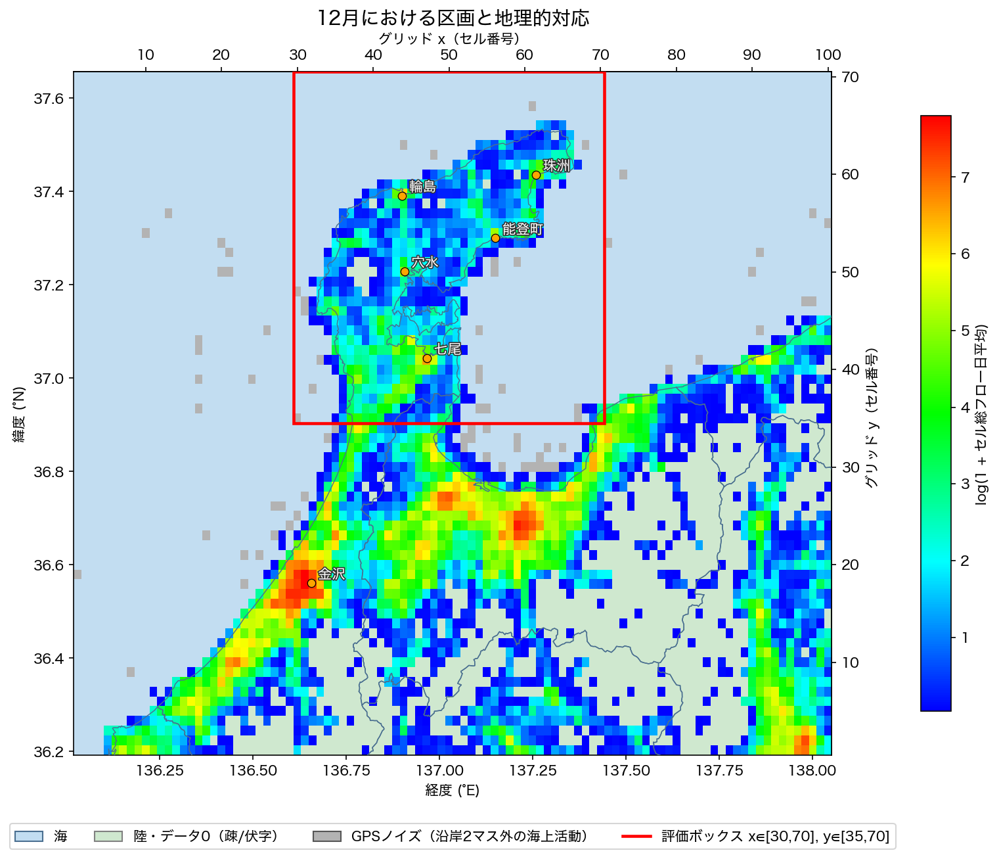
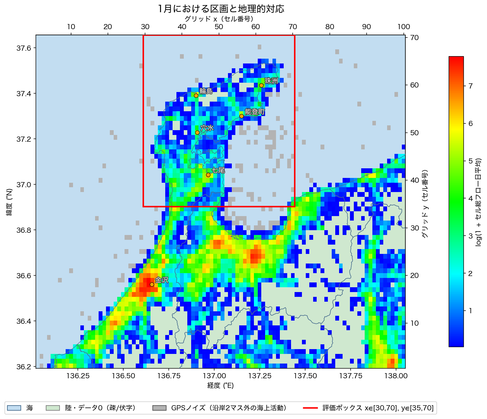
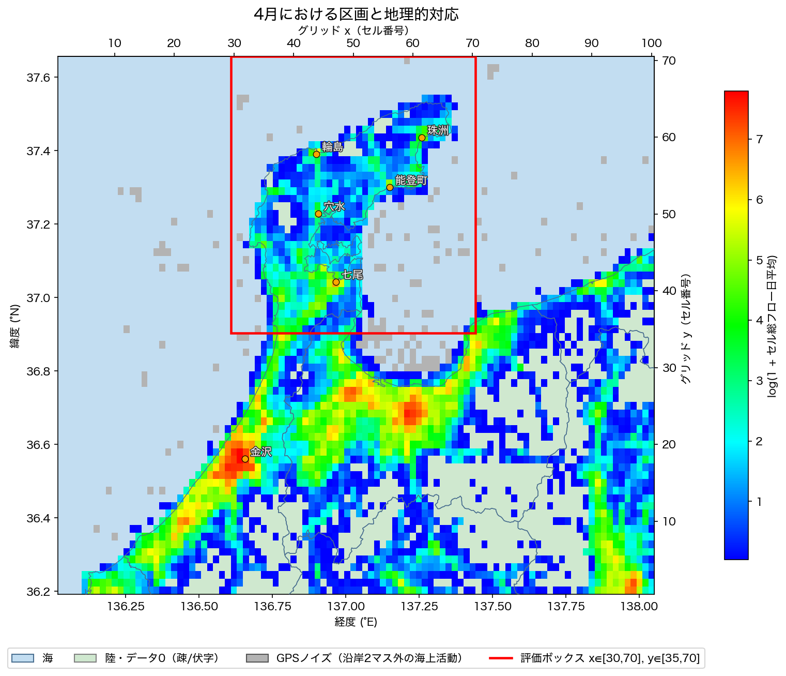
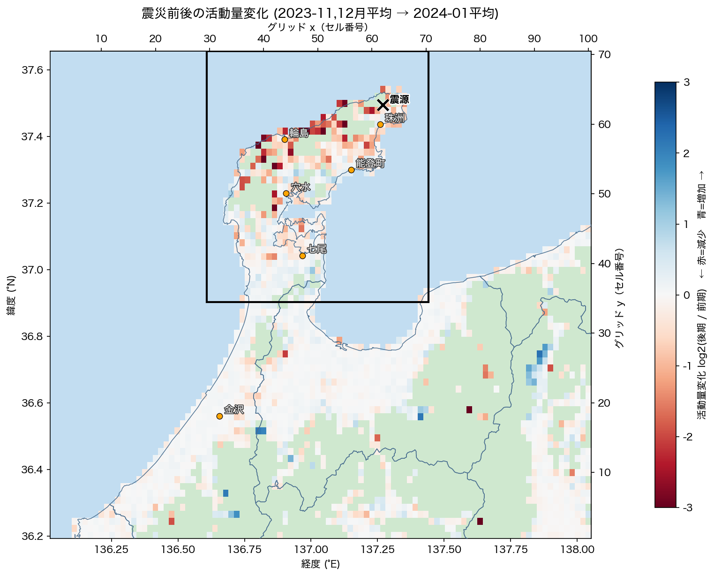
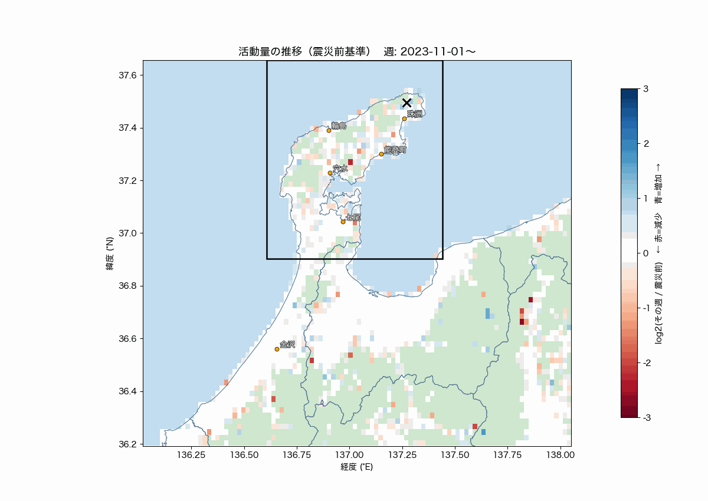

<a id="toc"></a>
# HuMob Challenge 2026 — EDA 図解ドキュメント

能登半島地震（2024/1/1）後の復興期における OD 行列予測タスク（テスト期間 2024/2/1〜3/31）に向けた探索的分析（EDA）の図解。各図が「何を表すか・前提・数字の定義・そこからわかること」をまとめる。

- 対象データ: `data/raw/humob2026-dataset.tsv`（TSV, 306行, 2023-11-01〜2024-10-31, Feb-Mar はテスト期間で欠落）
- 本文では公開済みの図について、前提・数値の定義・読み取れる傾向を整理する。

---

## 目次

| # | 図 | ジャンプ |
|---|----|---------|
| 01 | 区画の地理的対応（活動量マップ, 3ヶ月） | [▶ 01 へ](#fig01) |
| 02 | 震災ダメージマップ（前→直後） | [▶ 02 へ](#fig02) |
| 03 | 活動量アニメーション（週次） | [▶ 03 へ](#fig03) |

---

<a id="repro"></a>
## 公開範囲

入力となるコンペ配布データとローカルの地理データは公開範囲に含めない。
基本となる地理対応図は `src/common/grid_geo_map.py` で再生成できる。それ以外の補助的な
可視化スクリプトは含めず、生成済みの図と解釈に必要な定義・分析結果を公開する。

```bash
python3 src/common/grid_geo_map.py --month 2023-12
```

[▲ 目次へ](#toc)

---

<a id="common"></a>
## 共通の前提・用語（数字の定義）

すべての図で共通する定義。各セクションではこれを前提に個別の定義だけ補足する。

- **グリッド区画**: セルIDは `"y_x"` 形式。`x`=1..100（経度 136.029〜138.042°E）、`y`=1..70（緯度 36.203〜37.646°N）。**1セル≈2km四方**。セル→緯度経度は線形変換。図の上/右の副軸がセル番号、下/左の主軸が緯度経度。
- **活動量（presence）**: あるセルを **origin** とする全 dest へのフロー合計（**自セル滞留＝対角も含む**）。＝「そのセルにいる/そこから動く人の量」。多くの図は月・週の**日平均**。
- **定数正規化**: 日次合計が全日で一定（≈189190.25）。→ **絶対的な移動総量は復元不能**だが、**セル間・日間の相対比較は可能**（総量が保存されるため、あるセルが減れば別セルが増える）。
- **k-匿名化**: 実カウント10未満のODは削除（伏字）。→ **「データ無し」は"真の0"とは限らず、10未満で伏せられた可能性**。
- **評価ボックス（採点対象）**: `x∈[30,70], y∈[35,70]`（能登半島北部）。採点はこの中の OD フローの **SSE（二乗誤差和）**。**SSEの約99.7%は対角（域内滞留）**が占める。
- **震源**: 2024-01-01 16:10、北緯37度29.7分・東経137度16.2分＝**137.270°E / 37.495°N**（珠洲北の沖合）。図では×印。
- **GPSノイズ**: 海判定 & 活動あり & 沿岸線から2マス以上離れたセル。汀線から離れた海上の活動は測位誤差（実データで純対角・単発・下限値と確認）。

[▲ 目次へ](#toc)

---

<a id="fig01"></a>
## 01. 区画の地理的対応（活動量マップ, 3ヶ月）





- **表すもの**: 各セル発の活動量（総フロー日平均）を実地図上に色で示す。上=2023-12（震災前）/中=2024-01（直後）/下=2024-04（復興初期）。海岸線を下地に、区画↔地図位置を対応づける。
- **前提**: セル→緯度経度の線形変換。海/陸/GPSノイズの3分類を下地色で区別。
- **数字の定義**:
  - 色 = **log(1 + セル総フロー日平均)**（活動量の対数。ロングテールを圧縮するため対数）。
  - 下地色: **水色=海（0区画）** / **薄緑=陸だがデータ0（疎/伏字）** / **薄グレー=GPSノイズ**。
  - 赤枠=評価ボックス、オレンジ点=主要都市、×=震源。
- **わかること**:
  - 活動は**海岸線・平野に沿い、金沢が最大**（≈y18）。都市の地理は毎月ほぼ不変。
  - **北部（評価ボックス内）はもともと疎**なセルが多い（人口小）。
  - 3ヶ月比較で、**1月（直後）は北部の活動が疎化**（GPSノイズ判定セルも最多141）、**4月に一部回復**（128）、12月は最も密（75）。＝地震で北部の人が抜けた痕跡。
  - **注意**: この図は「絶対量の対数」なので、倍率変化は圧縮されて見えにくい（変化を見るには 02 の比マップを使う）。

[▲ 目次へ](#toc)

---

<a id="fig02"></a>
## 02. 震災ダメージマップ（震災前 → 直後）



- **表すもの**: 震災前から直後にかけて、各セルの活動量が**どれだけ減った（＝人が抜けた＝被害）**かを比で示す。
- **前提**: 総量が定数正規化で保存されるため、セル別の活動量は日をまたいで比較可能。「被害」は直接指標ではなく**活動量減少を代理指標**とする。
- **数字の定義**:
  - 色 = **log2( 直後 2024-01平均 ÷ 震災前 2023-11,12月平均 )**。
  - **赤（負）=減少＝被害大** / 青（正）=増加 / 白=ほぼ不変。範囲 ±3（=8倍変化）。
  - 対象は震災前に活動があったセル（before≥1）、外洋は除外。
- **わかること**:
  - **深い赤が輪島・珠洲・能登町・穴水（半島北部＝震源周辺）に集中**。南（金沢・平野）はほぼ白＝無被害。**被害は北部に局在**。
  - 被害上位: **59_44（輪島付近）16.4→3.3（0.20x）**、54_38 10.4→3.0（0.29x）、59_47 9.4→0.9（0.10x）など、北部で7〜9割減。
  - 震源直下は沖（海=データ無）なので、被害は最寄りの陸地に現れる。

[▲ 目次へ](#toc)

---

<a id="fig03"></a>
## 03. 活動量アニメーション（週次・震災前基準）



- **表すもの**: 各週の活動量を震災前基準で比較し、**ショック→（テスト期間の空白）→回復**の時間推移を再生。
- **前提**: 週次に集計（ノイズ低減）。Feb-Mar はデータ無しで飛ぶ。基準は震災前8週（2023-11〜12月）。全46週。
- **数字の定義**:
  - 色 = **log2( その週平均 ÷ 震災前平均 )**。赤=減少 / 青=増加、±3。
- **わかること**（評価ボックスの北部/南部集計より）:
  - **被害は北部だけに局在**（南部は常に≈100%）。
  - 直前に **年末年始スパイク（帰省, 2023-12-27週 +15%）** ＝季節交絡に注意。
  - **ショックは一瞬でなく2〜3週かけて深まる**（北部比 97%→90%→82%→**79%（1/24週で底）**）。
  - **回復は部分的で頭打ち**: 4月 ~90% → 夏 90〜93% → 10月でも 93〜96%。**震災前水準へ完全復帰していない**。
  - → **テスト期間 Feb-Mar は「1月の底(北部~80%)」と「4月のプラトー(~90%)」の間**。

[▲ 目次へ](#toc)
