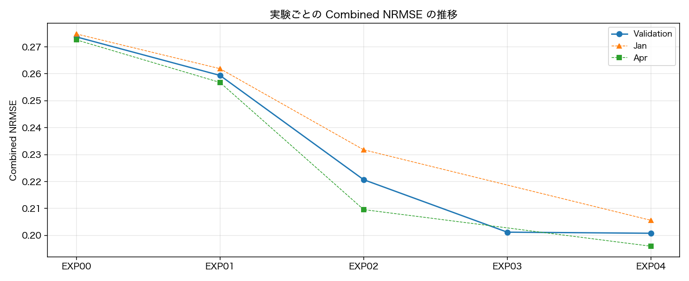

# HuMob Challenge 2026

2024年能登半島地震の復興期における OD 行列予測タスク（テスト期間 2024/2/1〜3/31）。
主要指標は **Combined NRMSE**（小さいほど良い / 全ゼロ予測が約 1.0）。

## 公開範囲

このリポジトリは、実験コード・実験設計・評価結果・可視化結果を公開する。コンペ配布データ、
外部資料の原本、前処理済みデータは再配布しないため、`data/` と `events/` は含まれない。
各スクリプトの先頭に、ローカルで必要な入力パスと生成する出力を記載している。

## 公開リポジトリの構成

```text
.
├── README.md
├── EDA.md
├── requirements.txt
├── src/
│   ├── EXP00_run.py ... EXP04_run.py  # 学習・検証・提出生成
│   ├── plot_score_history.py          # スコア推移図の生成
│   ├── common/                        # 公式指標、提出検査、共通評価（READMEあり）
│   └── preprocessing/                 # 外部データの前処理（READMEあり）
├── experiments/
│   ├── README.md                       # 記録構成、metrics・log・CSVの仕様
│   ├── EXP00/ ... EXP04/              # 実験計画、結果、表、図
│   └── score_history.png
└── figures/                            # EDAの出力図
```

## セットアップ

実験時のPythonバージョンは3.9.6。

```bash
python3 -m venv .venv
source .venv/bin/activate
python3 -m pip install -r requirements.txt
```

コンペ配布データと外部資料は同梱しない。各自で取得し、次の位置へ配置する。

```text
data/
├── raw/humob2026-dataset.tsv
└── processed/
    ├── events/population_cell_map.csv
    ├── 避難者率/市町別避難者率.csv
    ├── 断水率/市町別断水率.csv
    ├── 避難所/避難所_セル別集計.csv
    └── weather/weather.csv
```

EXP00〜EXP02は配布ODのみ、EXP03〜EXP04は上記の前処理済み外部特徴も使用する。
入力・出力の詳細は各`src/EXP*_run.py`冒頭、
[`experiments/README.md`](experiments/README.md)、
[`src/preprocessing/README.md`](src/preprocessing/README.md)に記載している。

## 実行

```bash
python3 src/EXP00_run.py
python3 src/EXP01_run.py
python3 src/EXP02_run.py
python3 src/EXP03_run.py
python3 src/EXP04_run.py
```

各スクリプトはローカル検証から提出物生成・形式検査までを一度に行う。主催者配布の公式validatorは
再配布せず、ローカルの`src/common/humob2026_validator.py`に置いた場合だけ提出生成時に追加実行する。

再生成できる検証予測TSVや、`metrics.json`と重複する候補別・日別CSVは保存しない。
CSVはレポートで直接使う地域別誤差や収束診断など、集計結果として意味があるものに限定する。

## 実験一覧
| ID | 日付 | 概要 | 比較元 | 統合 | jan | Δjan | apr | Δapr | 判定 |
|---|---|---|---|---:|---:|---:|---:|---:|---|
| [EXP00](experiments/EXP00/report.md) | 2026-09-21 | 学習データ端点（1/22・4/9）の線形補間 | - | **0.2737** | 0.2748 | - | 0.2726 | - | 基準 |
| [EXP01](experiments/EXP01/report.md) | 2026-09-21 | 同曜日の前後2点による曜日別線形補間 | EXP00 | **0.2594** | 0.2619 | -0.0129 | 0.2568 | -0.0158 | 採用 |
| [EXP02](experiments/EXP02/report.md) | 2026-09-21 | A窓2種×出現時代表値2種を比較（震災前を含むA窓×平均値を採用） | EXP01 | **0.2207** | 0.2318 | -0.0301 | 0.2096 | -0.0472 | 採用 |
| [EXP03](experiments/EXP03/report.md) | 2026-09-21 | 対角セル別状態空間＋非対角総量×配分（避難・断水・気象を採用） | EXP02 | **0.2012** | 0.2060 | -0.0258 | 0.1964 | -0.0132 | 採用候補 |
| [EXP04](experiments/EXP04/report.md) | 2026-09-21 | EXP03の非対角を出発側・到着側から推定し1:1結合 | EXP03 | **0.2008** | 0.2056 | -0.0004 | 0.1960 | -0.0004 | 採用 |

### スコア推移



```bash
python3 src/plot_score_history.py
```
