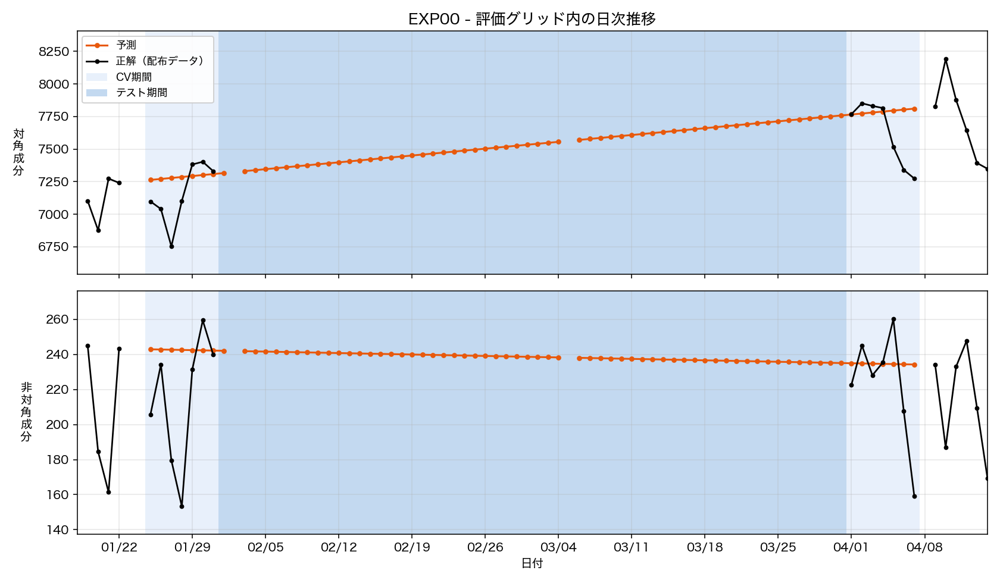
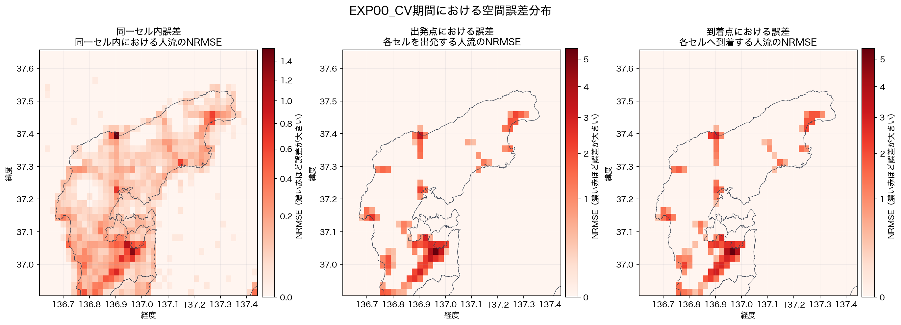

# EXP00 — 検証14日を外側から挟む単日2点の線形補間（ベースライン）

- **コード**: [`src/EXP00_run.py`](../../src/EXP00_run.py)
- **事前設計**: [`strategy.md`](strategy.md)
- **数値**: [`metrics.json`](metrics.json)（実行時に自動更新）
- **比較元**: -（ベースラインなので比較元なし）
- **主な出力**: ローカル生成物 `outputs/submission.tsv`、公開集計
  [`municipality_errors.csv`](outputs/municipality_errors.csv)
- **図**: [`figures/`](figures/) — `local_error_map.png`, `EXP00_pred_dist.png`
- **実行記録**: [`.log`](.log)

```bash
python3 src/EXP00_run.py
```

## 仮説

回復過程は1月の底から4月のプラトーへ向かう単調な変化なので、その両端を押さえた
1次近似（＝2点の線形補間）だけで、全ゼロ予測より大幅に良いスコアが出るはず。
空間構造が月をまたいでほぼ不変であることも、この単純さを支持する。

## 手法

検証窓とテスト期間を**外側から挟む観測日2点**をアンカーに取り、ODペアごとに日付で
線形補間する。

| | 目標日 | 実際に使った日 | ペア数 |
|---|---|---|---:|
| アンカーA | 2024-01-24 | **2024-01-22（月）**（NAのため2日さかのぼり） | 5,766 |
| アンカーB | 2024-04-08 | **2024-04-09（火）**（NAのため1日進めた） | 5,623 |

- 区間78日。両アンカーの和集合 6,677 ペアが予測対象で、片方にしか無いペアはもう一方を
  0 として内分する。
- 予測は `value = a + (b - a) * w`、`w` は日付のアンカー間位置（A で 0、B で 1）。
- 日次合計はどちらのアンカーも同じ定数なので、内分しても総量 189,190.2509 が保たれる
  （形式検査5項目の「日次総量」で最大相対誤差 2.27e-10 を確認）。

## 検証設計

- 検証窓: `jan` = 2024-01-25〜01-31（7日）、`apr` = 2024-04-01〜04-07（7日）。
- **リーク防止**: 検証14日はどちらもアンカーの内側にあり、アンカー自身は窓に含まれない。
  予測は両窓とも同一の補間直線から作る。
- 主基準は14日を1本にまとめた統合 Combined NRMSE。全ゼロ予測（≈1.0）との比を併記する。

## 結果

| 窓 | 日数 | NRMSE_diag | NRMSE_off | **Combined NRMSE** | 全ゼロ予測比 |
|---|---:|---:|---:|---:|---:|
| **統合** | 14 | 0.1171 | 0.4303 | **0.2737** | 0.2851 |
| `jan` | 7 | 0.1126 | 0.4370 | 0.2748 | 0.2973 |
| `apr` | 7 | 0.1217 | 0.4236 | 0.2726 | 0.2737 |

ベースラインのため比較元なし。以降の実験はこの統合 **0.2737** を基準にする。

誤差の内訳（二乗和に占める割合）:

| 窓 | 種別 | hit | miss | extra | 観測ペア/日 | 予測ペア/日 |
|---|---|---:|---:|---:|---:|---:|
| `jan` | diagonal | 97.7% | 0.5% | 1.8% | 371 | 438 |
| `jan` | offdiagonal | 35.4% | 17.9% | 46.6% | 117 | 167 |
| `apr` | diagonal | 97.8% | 0.5% | 1.7% | 393 | 438 |
| `apr` | offdiagonal | 34.0% | 19.6% | 46.4% | 119 | 167 |

## 誤差分析

`population_cell_map.csv`の担当市町に従い、14日統合の誤差を地域別に集計した。対角はセルの
担当市町、非対角は同じOD誤差を起点市町と終点市町の2通りで集計している。起点列と終点列は
独立した診断軸なので、両者を足し合わせない。

3つの指標は見ているものが違う。**`SSE比`は誤差の発生地域**、**`NRMSE`は地域のセル数を
母数にした誤差の大きさ**、**`SSE/Σy²`は全ゼロ予測（＝その地域について何も予測しない）を
1.0としたときの相対誤差**である。前2つは地域の流動規模に比例して大きくなるので地域間の
難易度比較には使えない。難易度は`SSE/Σy²`で読む。

| 地域 | 担当セル | 対角 NRMSE | 対角 SSE比 | 対角 SSE/Σy² | 非対角 NRMSE（起点 / 終点） | 非対角 SSE比（起点 / 終点） | 非対角 SSE/Σy²（起点 / 終点） |
|---|---:|---:|---:|---:|---:|---:|---:|
| 七尾市 | 123（8.333%） | 0.2532 | 38.530% | 0.010 | 1.0634 / 1.0494 | 51.025% / 49.635% | **0.138 / 0.135** |
| 珠洲市 | 107（7.249%） | 0.1126 | 7.195% | 0.051 | 0.4299 / 0.4299 | 7.525% / 7.525% | 0.284 / 0.284 |
| 穴水町 | 63（4.268%） | 0.1175 | 4.715% | 0.035 | 0.3641 / 0.3687 | 3.158% / 3.207% | 0.583 / 0.587 |
| 能登町 | 89（6.030%） | 0.1188 | 6.181% | 0.027 | 0.2806 / 0.2806 | 2.674% / 2.674% | **4.097 / 4.097** |
| 輪島市 | 154（10.434%） | 0.1329 | 16.351% | 0.021 | 0.4127 / 0.4116 | 9.987% / 9.938% | 0.202 / 0.202 |
| 志賀町 | 85（5.759%） | 0.1459 | 8.904% | 0.024 | 0.5208 / 0.5208 | 8.632% / 8.632% | 0.477 / 0.477 |
| 中能登町 | 20（1.355%） | 0.3181 | 10.425% | 0.019 | 1.3581 / 1.4318 | 13.789% / 15.287% | 0.324 / 0.338 |
| 羽咋市 | 20（1.355%） | 0.2383 | 5.792% | 0.043 | 0.6506 / 0.6406 | 3.210% / 3.102% | **1.393 / 1.413** |
| 対象8市町外・富山県 | 815（55.217%） | 0.0215 | 1.907% | 0.046 | 0.0000 / 0.0000 | 0.000% / 0.000% | — / — |
| **全体** | **1,476（100%）** | **0.1171** | **100%** | **0.016** | **0.4303 / 0.4303** | **100% / 100%** | **0.194 / 0.194** |

七尾市は全セルの8.333%だが、非対角SSEの約半分（起点51.025%、終点49.635%）を占める。ただ
**これは規模の効果で、難易度ではない。** 非対角`SSE/Σy²`は0.138と8市町中で最も小さく、
相対的にはこのベースラインが最もよく当たっている地域である。誤差が集中するのは、単に
七尾市に予測すべき流動が最も多いからにすぎない。

`SSE/Σy²`で見ると、実際に予測が破綻しているのは**能登町（4.097）と羽咋市（1.393）**の
2市町である。どちらも1.0を超えており、**この地域については何も予測しない方が誤差が小さい**。
非対角SSE比はそれぞれ2.674%、3.210%と小さいので全体スコアへの寄与は限られるが、モデルが
正味で有害な唯一の地域として記録しておく。

中能登町は対角NRMSE 0.3181、非対角NRMSE 起点1.3581で見かけ上8市町中最悪だが、`SSE/Σy²`は
0.324で中位である。20セルしかないため分母が小さく、NRMSEが押し上げられている。

「対象8市町外・富山県」はセルの55.217%を占めるが、対角SSE比は1.907%、非対角は0%である。
セル数だけで重要地域を判断すると、この大きな低誤差領域に評価が引っ張られる。

## 図と考察

### `figures/EXP00_pred_dist.png`



対角は緩やかに増加し、非対角は緩やかに減少するほぼ直線的な予測になっている。正解にある
週ごとの上下をまったく表せておらず、4月初旬の対角の上振れや非対角の日曜の落ち込みも追えて
いない。2点補間は長期的な水準を置くベースラインとしては機能するが、曜日変動を扱う必要性が
この図から明確に分かる。図は評価対象ODの合計であり、提出TSV全体の一定総量とは一致しない。

### `figures/local_error_map.png`



対角誤差は南部から中央部と北部沿岸の一部に集中し、非対角も南部のハブと沿岸の複数セルが
目立つ。非対角の起点図と終点図はよく似ており、限られた拠点間の流動を両方向から外している
ことを示す。全域一様な補正より、曜日効果と高流量拠点の扱いを優先すべき分布である。

## 解釈

**全ゼロ予測の約0.285倍**まで誤差が落ちた。単純な直線1本でも、予測する価値は明確にある。

**誤差の主因は offdiagonal 側**。統合スコアの内訳は diag 0.1171 に対し off 0.4303 で、
Combined の8割近くを offdiagonal が占める。SSEの99.7%は対角が占めるのに、正規化後は
非対角の方が効くという構造で、**スコアを動かすなら非対角の当て方**だと分かる。

**非対角の誤差は `extra`（予測にあり正解に無い）が半分近く**（46%前後）。予測は毎日
167ペアを出しているのに観測は117〜119ペアしかなく、**出しすぎている**。アンカー2日の
和集合をそのまま引き延ばすので、片方の日にしか現れない一過性のペアが全58日に残り続ける
のが原因。逆に `miss`（正解にあり予測に無い）も18〜20%あり、和集合に無い新規ペアは
原理的に当てられない。

**対角は既にほぼ当たっている**（hit 97.7%）。予測438セルに対し観測371〜393セルで、
こちらの extra は1.8%しか誤差に効いていない。対角側の改善余地は小さい。

**jan と apr でスコアがほぼ割れなかった**（0.2748 vs 0.2726、差0.002）。当初は
アンカーから遠い側で悪化すると考えていたが、**直線の傾きはほぼ効いていない**ことを示す。
日別に見ると apr 窓の末尾2日（4/6土・4/7日）だけ 0.307 と悪く、これは曜日効果であって
補間の位置ずれではない。

## 失敗した試み

ベースライン実験のため、2点線形補間以外の候補は比較していない。

## 採否判定

**採用**（ベースライン）。統合 Combined NRMSE **0.2737** を以降の基準線とする。

## 制約・未解決

- 2アンカーの和集合にない新規ODは予測できず、一方にしかない一過性ODは予測期間中に残る。
- 曜日効果を持たないため、正解の日次変動を再現できない。
- 同じ日次総量を保つことは形式上の安定性であり、セル・OD単位の精度を保証しない。
