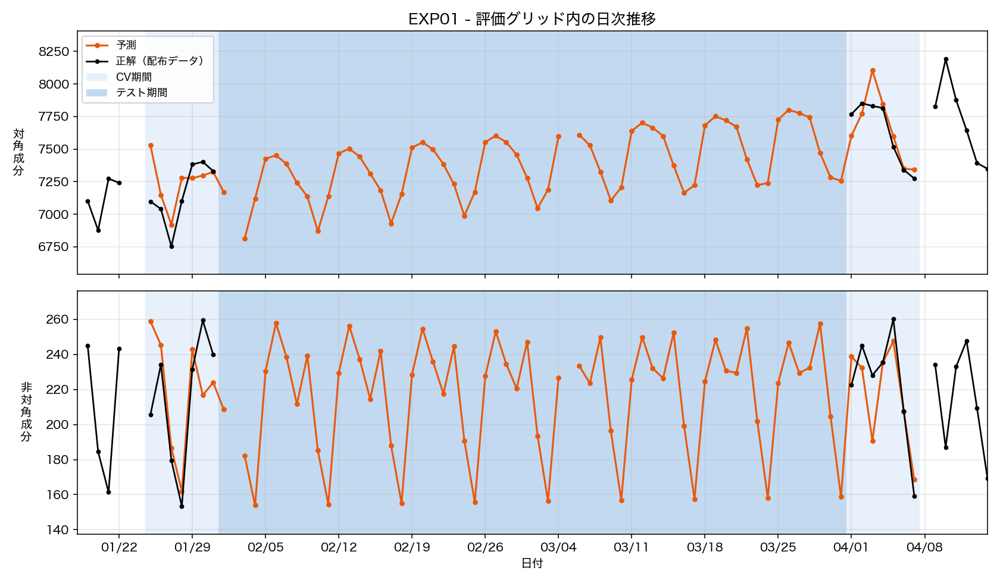
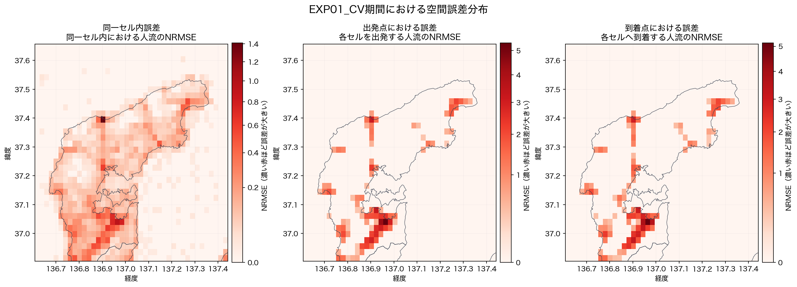

# EXP01 — 予測日と同じ曜日をアンカーに取る線形補間

- **コード**: [`src/EXP01_run.py`](../../src/EXP01_run.py)
- **事前設計**: [`strategy.md`](strategy.md)
- **数値**: [`metrics.json`](metrics.json)（実行時に自動更新）
- **比較元**: EXP00
- **主な出力**: ローカル生成物 `outputs/submission.tsv`、公開集計
  [`municipality_errors.csv`](outputs/municipality_errors.csv)
- **図**: [`local_error_map.png`](figures/local_error_map.png),
  [`EXP01_pred_dist.png`](figures/EXP01_pred_dist.png)
- **実行記録**: [`.log`](.log)

```bash
python3 src/EXP01_run.py
```

## 仮説

固定した平日2日のみを使う EXP00 は、予測対象日の曜日水準を表せなかった。予測日と同じ
曜日の前後2日をアンカーにし、曜日ごとに独立した補間直線を作れば、特に週末の誤差が減る
と考えた。一方、アンカーが最も遠い木曜は悪化する可能性がある。

## 手法

検証窓の外側から、予測日と同じ曜日の直近観測日を前後1日ずつ選び、ODペアごとに
`value = a + (b - a) * w` で線形補間した。候補日が NA の場合は、曜日を保つため7日刻みで
外側へ移動した。ハイパーパラメータはない。

検証用アンカーは次のとおり。

| 曜日 | アンカーA | アンカーB | 区間 |
|---|---:|---:|---:|
| 月 | 2024-01-22 | 2024-04-15 | 84日 |
| 火 | 2024-01-16 | 2024-04-09 | 84日 |
| 水 | 2024-01-17 | 2024-04-10 | 84日 |
| 木 | 2024-01-11 | 2024-04-11 | 91日 |
| 金 | 2024-01-19 | 2024-04-12 | 84日 |
| 土 | 2024-01-20 | 2024-04-13 | 84日 |
| 日 | 2024-01-21 | 2024-04-14 | 84日 |

提出時は全観測データを使い、境界 2024-01-31 / 2024-04-01 の外側にある同曜日を選んだ。
アンカー区間は曜日により63日または70日となった。

### 実装と生成物

`EXP01_run.py` は予測ロジックだけを持ち、公式指標、実行ログ、誤差マップ、予測推移図には
`src/common/`の共通関数を使用した。

- 14日分の予測をメモリ上で生成し、リーク検査、公式指標、曜日別評価、誤差内訳を計算する。
  `metrics.json`、`local_error_map.png`を更新し、`.log`へ追記する。
- 引数なし: テスト58日の`submission.tsv`を生成し、形式検査後に`EXP01_pred_dist.png`を作る。
- 使用した曜日別アンカーとNAによる移動は、実行時の標準出力と`.log`で確認する。

提出TSVは、対象58日、除外日、辞書構造、グリッドID、負値、日次総量の5項目をすべて通過した。
日次総量は全日189,190.2509で、最大相対誤差は2.27e-10だった。

## 検証設計

- 検証窓は EXP00 と同じ `jan` = 2024-01-25〜01-31、`apr` = 2024-04-01〜04-07。
- 14アンカーすべてが検証14日の外側にあることを実行時に検査した。
- 主基準は14日統合の Combined NRMSE。EXP00 の 0.2737 と比較した。
- 仮説の確認用に、平日・週末および各曜日のスコアを併記した。

## 結果

| 窓 | 日数 | NRMSE_diag | NRMSE_off | **Combined NRMSE** | 全ゼロ予測比 |
|---|---:|---:|---:|---:|---:|
| **統合** | 14 | 0.1077 | 0.4110 | **0.2594** | 0.2701 |
| `jan` | 7 | 0.1130 | 0.4107 | 0.2619 | 0.2833 |
| `apr` | 7 | 0.1024 | 0.4113 | 0.2568 | 0.2579 |

比較元との差（負値が改善）:

| 窓 | EXP00 | EXP01 | 差分 |
|---|---:|---:|---:|
| **統合** | 0.2737 | **0.2594** | **-0.0143** |
| `jan` | 0.2748 | 0.2619 | -0.0129 |
| `apr` | 0.2726 | 0.2568 | -0.0158 |

曜日別の結果:

| 区分 | 日数 | NRMSE_diag | NRMSE_off | **Combined NRMSE** |
|---|---:|---:|---:|---:|
| 平日 | 10 | 0.1085 | 0.4142 | **0.2614** |
| 週末 | 4 | 0.1056 | 0.4030 | **0.2543** |

| 月 | 火 | 水 | 木 | 金 | 土 | 日 |
|---:|---:|---:|---:|---:|---:|---:|
| 0.2555 | 0.2582 | 0.2463 | **0.2883** | 0.2586 | 0.2626 | 0.2461 |

統合した誤差内訳:

| 種別 | hit | miss | extra | 観測ペア/日 | 予測ペア/日 |
|---|---:|---:|---:|---:|---:|
| diagonal | 97.0% | 0.8% | 2.2% | 381.9 | 441.6 |
| offdiagonal | 40.1% | 22.0% | 38.0% | 118.4 | 155.6 |

## 誤差分析

14日統合の地域別NRMSE・SSE比・全ゼロ比を示す。対角はセルの担当市町、非対角は起点市町・
終点市町の2通りで集計した。非対角の起点列と終点列は別の診断軸であり、両者を足し合わせない。
`SSE/Σy²`は全ゼロ予測を1.0とした相対誤差で、地域の流動規模で正規化されるため**地域間の
難易度比較にはこの列を使う**（`SSE比`と`NRMSE`は規模に比例して大きくなる）。

| 地域 | 担当セル | 対角 NRMSE | 対角 SSE比 | 対角 SSE/Σy² | 非対角 NRMSE（起点 / 終点） | 非対角 SSE比（起点 / 終点） | 非対角 SSE/Σy²（起点 / 終点） |
|---|---:|---:|---:|---:|---:|---:|---:|
| 七尾市 | 123（8.333%） | 0.2174 | 33.946% | 0.007 | 1.0085 / 0.9942 | 50.325% / 48.825% | **0.123 / 0.120** |
| 珠洲市 | 107（7.249%） | 0.1041 | 7.041% | 0.041 | 0.4221 / 0.4221 | 7.783% / 7.783% | 0.266 / 0.266 |
| 穴水町 | 63（4.268%） | 0.1241 | 5.968% | 0.037 | 0.3419 / 0.3428 | 3.352% / 3.463% | 0.562 / 0.575 |
| 能登町 | 89（6.030%） | 0.1126 | 6.662% | 0.024 | 0.2214 / 0.2214 | 1.858% / 1.858% | **2.585 / 2.585** |
| 輪島市 | 154（10.434%） | 0.1242 | 17.066% | 0.018 | 0.3723 / 0.3693 | 9.128% / 8.999% | 0.168 / 0.166 |
| 志賀町 | 85（5.759%） | 0.1462 | 10.639% | 0.024 | 0.4846 / 0.4846 | 8.286% / 8.286% | 0.415 / 0.415 |
| 中能登町 | 20（1.355%） | 0.2857 | 10.058% | 0.015 | 1.4232 / 1.5001 | 16.572% / 18.317% | 0.353 / 0.367 |
| 羽咋市 | 20（1.355%） | 0.2318 | 6.731% | 0.042 | 0.5643 / 0.5394 | 2.696% / 2.468% | **1.062 / 1.021** |
| 対象8市町外・富山県 | 815（55.217%） | 0.0192 | 1.888% | 0.038 | 0.0000 / 0.0000 | 0.000% / 0.000% | — / — |
| **全体** | **1,476（100%）** | **0.1077** | **100%** | **0.013** | **0.4110 / 0.4110** | **100% / 100%** | **0.176 / 0.176** |

EXP00と比べ、非対角の起点別NRMSEは8市町中7市町で改善した。能登町は0.2806から0.2214、
羽咋市は0.6506から0.5643まで下がっており、曜日別アンカーは多くの地域で有効だった。
対角も七尾市0.2532→0.2174、中能登町0.3181→0.2857など、大きな誤差を持つ地域で改善した。

`SSE/Σy²`でも8市町すべてで改善している（七尾市 0.138→0.123、能登町 4.097→2.585、
羽咋市 1.393→1.062）。曜日別アンカーの効果は規模の大小によらず一様だった。

ただし、中能登町の非対角は起点1.3581→1.4232、終点1.4318→1.5001と悪化した。`SSE/Σy²`でも
0.324→0.353と悪化しているので、これは規模由来ではなく実際に予測が後退している。曜日を
合わせるだけでは、中能登町に関係する間欠的なODの出現有無を捉えられていない。

七尾市は依然として起点SSEの50.325%を占めるが、`SSE/Σy²`は0.123で8市町中最小である。
**誤差の集中は七尾市に流動が最も多いことの反映であって、七尾市が難しいという意味ではない。**
1.0を超えて正味で有害なのは能登町（2.585）と羽咋市（1.062）だが、両者の非対角SSE比は
合計4.554%しかなく、全体スコアを動かす余地は小さい。したがって次に扱うべきは特定の地域
ではなく、全地域に共通するODペアの出現確率である。

## 図と考察

### `figures/EXP01_pred_dist.png`



EXP00にはなかった週次の上下が予測に入り、対角・非対角とも正解の日次変動へ近づいた。特に
週末の谷を再現できている一方、アンカーが遠い木曜などでは正解との差が残る。同曜日を合わせる
だけでも大きく改善するが、各曜日2点の線形補間では突発的な増減までは表せない。

### `figures/local_error_map.png`



EXP00より南部の対角誤差と一部の非対角誤差は弱まったが、南部・沿岸部の高誤差セルという空間
構造は残った。起点と終点の誤差分布も引き続き似ており、曜日補正だけでは特定拠点に関係する
間欠的なODの出現を解決できていない。

## 解釈

統合スコアは EXP00 より 0.0143、相対で約5.2%改善した。`jan` と `apr` の両方で改善して
いるため、一方の検証窓だけに依存した結果ではない。対角・非対角もそれぞれ 0.1171→0.1077、
0.4303→0.4110 と両方改善した。

週末の Combined は 0.2543 で平日の 0.2614 より低く、EXP00 で見られた週末の弱さは
このモデル内では残っていない。ただし、曜日別では木曜が 0.2883 と明確に悪い。木曜だけ
アンカーAが境界から13日前、補間区間が91日であり、strategy.md で想定したアンカー鮮度との
トレードオフが実測にも表れた。

非対角の `extra` は EXP00 の約46%から38.0%へ低下し、予測ペア数も167件/日から155.6件/日
へ減った。一方で `miss` は EXP00 の18〜20%から22.0%へ増えている。同曜日アンカーは
一過性ペアの出しすぎを抑えたが、正解日に新しく現れるペアを拾う問題は残る。

## 失敗した試み

今回の実行では、strategy.md に記載した曜日別線形補間以外の手法は試していない。

## 採否判定

**採用**。主基準の統合 Combined NRMSE が EXP00 の 0.2737 から 0.2594 に改善し、両検証窓
でも一貫して改善したため、次の比較基準とする。

## 制約・未解決

- 各曜日は2日しか評価していないため、曜日別スコア、とくに木曜の差には標本数の制約がある。
- 木曜は「同曜日」と「アンカーの鮮度」を同時に満たせていない。
- 非対角の `extra` は減ったが38.0%残り、`miss` は22.0%ある。ペアの出現有無を補間だけで
  扱うことには限界がある。
