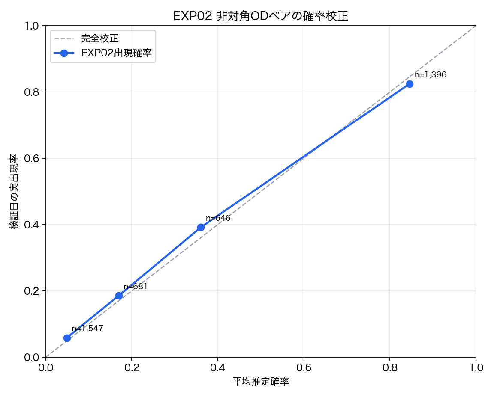
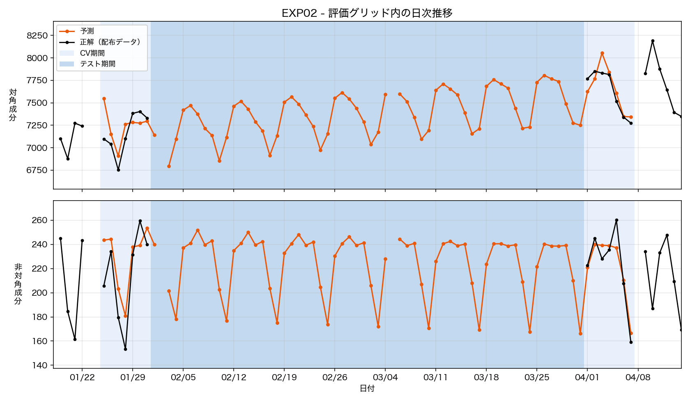
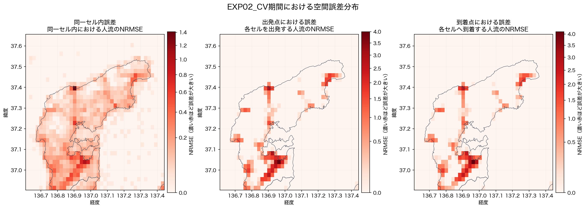

# EXP02 — A側期間と出現時代表値を選択する非対角ODのソフト予測

- **コード**: [`src/EXP02_run.py`](../../src/EXP02_run.py)
- **事前設計**: [`strategy.md`](strategy.md)
- **数値**: [`metrics.json`](metrics.json)（実行時に自動更新）
- **比較元**: EXP01
- **主な出力**: ローカル生成物 `outputs/submission.tsv`、公開集計
  [`municipality_errors.csv`](outputs/municipality_errors.csv)
- **図**: [`local_error_map.png`](figures/local_error_map.png),
  [`probability_calibration.png`](figures/probability_calibration.png),
  [`EXP02_pred_dist.png`](figures/EXP02_pred_dist.png)
- **実行記録**: [`.log`](.log)

```bash
python3 src/EXP02_run.py
```

## 仮説

EXP01は曜日ごとに前後1日ずつしか見ないため、単発の非対角ペアを予測期間全体へ残し、両日に
ないペアは生成できなかった。同曜日の複数日からペアの二値出現率を計算し、出現時の代表値へ
掛ければ、`extra`を縮小しながら`miss`も減らせると考えた。さらに、A側を震災後だけに絞ると、
震災前と異なるOD構造をより直接反映できる可能性を検証した。

## 手法

### Stage 1: 二値出現確率

非対角ペアについて、日付が観測済みなら「辞書に存在する=1、存在しない=0」とした。日付全体
が`NA`の場合は分母から除外した。A側・B側、曜日、ODペアごとに、

```text
出現確率 = ペアが出現した日数 / 有効観測日数
```

を計算した。A側は`full`と`post_quake`の2種類、代表値は中央値と平均値の2種類とし、合計4候補を
比較した。

| A窓 | 検証時 | 提出時 |
|---|---|---|
| `full` | 2023-11-01〜2024-01-24 | 2023-11-01〜2024-01-31 |
| `post_quake` | 2024-01-01〜2024-01-24 | 2024-01-01〜2024-01-31 |

B側は共通で、検証時2024-04-08〜06-30、提出時2024-04-01〜06-30とした。

### Stage 2: 出現時代表値の比較と総量保存

出現した日の値から中央値`median_positive`と平均値`mean_positive`を並行して計算した。
中央値は極端値に頑健で、平均値は二乗誤差に対する条件付き期待値に対応する。側ごとの期待人流を、

```text
expected_flow_median = 出現確率 * median_positive
expected_flow_mean   = 出現確率 * mean_positive
```

で作った。予測日は各候補ともA/Bの期待人流を日付位置で線形補間した。ハードな確率閾値は
使っていない。4候補を同じ14日で評価し、統合Combined NRMSEが最小の候補を採用した。

非対角を置き換えた後、EXP01のorigin別行合計から非対角合計を引いた残りを対角へ戻した。
非対角合計が行合計を超えたoriginだけ比例縮小した。これにより負値を作らず、origin別合計と
日次総量を維持した。

## 検証設計

- 検証窓はEXP01と同じ`jan` = 2024-01-25〜01-31、`apr` = 2024-04-01〜04-07。
- `full`の学習156日、`post_quake`の学習102日と検証14日が重ならないことを実行時に確認した。
- 主基準は14日統合Combined NRMSE。A窓2種×代表値2種の4候補から最小のものを選び、EXP01の
  0.2594と比較した。
- 候補別の数値は`metrics.json`へ保存するが、画像とTSVは採用候補だけを生成した。
- 出現確率は固定4ビンで推定確率と実出現率を比較した。
- `0.20`はsupport識別力の診断だけに使い、予測値の閾値には使っていない。

## 結果

### Stage 1: 出現確率

#### A窓による出現確率の違い

| A窓 | A側の曜日別観測日数 | coverage | 出現候補の平均確率 | 非出現候補の平均確率 | 確率0.20時precision / recall |
|---|---|---:|---:|---:|---:|
| `full` | 9〜12日 | **97.71%** | 0.6984 | **0.1785** | **0.6595** / 0.8691 |
| `post_quake` | 2〜4日 | 96.98% | 0.7267 | 0.2367 | 0.5614 / **0.8800** |

`post_quake`はrecallがわずかに上がった一方、非出現候補にも高い確率を付け、precisionが低下した。
以下の確率校正と生成図は、最終採用された`full` A窓の値である。

#### 採用A窓の出現確率校正

| 推定確率帯 | ペア数 | 平均推定確率 | 実出現率 |
|---|---:|---:|---:|
| 0.00〜0.10 | 1,547 | 0.0490 | 0.0582 |
| 0.10〜0.25 | 681 | 0.1694 | 0.1850 |
| 0.25〜0.50 | 646 | 0.3605 | 0.3916 |
| 0.50〜1.00 | 1,396 | 0.8455 | 0.8245 |

- 検証日に出現した候補ペアの平均確率: 0.6984
- 検証日に出現しなかった候補ペアの平均確率: 0.1785
- 学習期間の候補集合が検証日の正解ペアを含む割合: 97.71%（1,620 / 1,658）

同程度の予測ペア数でsupportを比較すると、EXP01のprecision / recallは0.6253 / 0.8215、
確率0.20以上では0.6595 / 0.8691だった。二値出現率は検証日の出現を識別できている。

### Stage 2: 代表値と総量保存

#### A窓2種×代表値2種の対決

| 候補 | A窓 | 代表値 | 統合 | jan | apr | NRMSE_diag | NRMSE_off | 判定 |
|---|---|---|---:|---:|---:|---:|---:|---|
| `full_median` | 震災前を含む | 中央値 | 0.2212 | 0.2319 | 0.2104 | 0.1087 | 0.3337 | - |
| **`full_mean`** | **震災前を含む** | **平均値** | **0.2207** | **0.2318** | **0.2096** | 0.1087 | **0.3327** | **採用** |
| `post_quake_median` | 震災後のみ | 中央値 | 0.2355 | 0.2606 | 0.2104 | **0.1081** | 0.3629 | - |
| `post_quake_mean` | 震災後のみ | 平均値 | 0.2363 | 0.2631 | **0.2096** | 0.1082 | 0.3644 | - |

4候補のうち、`full_mean`の統合Combined NRMSEが最小だったため採用した。標準の
`submission.tsv`と各画像はすべて`full_mean`から生成している。検証予測は図へ直接渡し、
再生成可能な中間TSVとしては保存しない。
候補別の画像・TSVは生成していない。

#### 採用した`full_mean`のスコア

| 窓 | 日数 | NRMSE_diag | NRMSE_off | **Combined NRMSE** | 全ゼロ予測比 |
|---|---:|---:|---:|---:|---:|
| **統合** | 14 | 0.1087 | 0.3327 | **0.2207** | 0.2299 |
| `jan` | 7 | 0.1135 | 0.3502 | 0.2318 | 0.2508 |
| `apr` | 7 | 0.1039 | 0.3153 | 0.2096 | 0.2104 |

比較元との差（負値が改善）:

| 窓 | EXP01 | EXP02 | 差分 |
|---|---:|---:|---:|
| **統合** | 0.2594 | **0.2207** | **-0.0387** |
| `jan` | 0.2619 | 0.2318 | -0.0301 |
| `apr` | 0.2568 | 0.2096 | -0.0472 |

曜日別Combined NRMSE:

| 月 | 火 | 水 | 木 | 金 | 土 | 日 |
|---:|---:|---:|---:|---:|---:|---:|
| 0.2116 | 0.2160 | **0.2083** | 0.2253 | 0.2301 | 0.2350 | 0.2186 |

統合した誤差内訳（EXP01との差分）。hit / miss / extra は**二乗和に占める割合**なので、
絶対量ではなく内訳の変化として読む:

| 種別 | 指標 | EXP01 | EXP02 | 差分 |
|---|---|---:|---:|---:|
| diagonal | hit | 97.0% | 97.0% | 0.0pt |
| diagonal | miss | 0.83% | 0.82% | -0.01pt |
| diagonal | extra | 2.20% | 2.16% | -0.04pt |
| diagonal | 予測ペア/日 | 441.6 | 441.5 | -0.1 |
| offdiagonal | hit | 40.1% | 63.2% | **+23.1pt** |
| offdiagonal | miss | 22.0% | 3.5% | **-18.5pt** |
| offdiagonal | extra | 38.0% | 33.3% | **-4.7pt** |
| offdiagonal | 予測ペア/日 | 155.6 | 305.0 | +149.4 |

正解ペア/日は両実験で同一（diagonal 381.9 / offdiagonal 118.4）。diagonal 側の内訳が
ほぼ動いていないのは、EXP02 が対角を予測しておらず、行合計の余りとして与えているため。

## 誤差分析

### 日別・市町別Combined NRMSE

地域の日別値は、各市町の対角NRMSEと、その市町を起点とする非対角NRMSEの単純平均である。
非対角を終点市町で集計した値ではない。市町ごとに担当セル数と人流規模が異なるため、地域間の
大小ではなく、**同じ地域の中でどの日に誤差が増えたか**を見る。太字は各列の14日間最大値、
全体列は通常の公式日別Combined NRMSEである。

| 日付 | 七尾市 | 珠洲市 | 穴水町 | 能登町 | 輪島市 | 志賀町 | 中能登町 | 羽咋市 | 全体 |
|---|---:|---:|---:|---:|---:|---:|---:|---:|---:|
| 2024-01-25 | 0.535 | **0.296** | 0.239 | 0.168 | **0.401** | 0.245 | 0.506 | 0.362 | **0.251** |
| 2024-01-26 | **0.589** | 0.277 | 0.216 | 0.118 | 0.271 | 0.205 | 0.867 | 0.231 | 0.243 |
| 2024-01-27 | 0.522 | 0.268 | 0.215 | 0.102 | 0.305 | 0.307 | **0.919** | 0.237 | 0.242 |
| 2024-01-28 | 0.542 | 0.265 | 0.104 | 0.134 | 0.289 | 0.246 | 0.802 | 0.174 | 0.232 |
| 2024-01-29 | 0.532 | 0.174 | 0.150 | 0.129 | 0.257 | 0.198 | 0.709 | 0.332 | 0.215 |
| 2024-01-30 | 0.501 | 0.229 | 0.185 | **0.181** | 0.288 | 0.286 | 0.740 | 0.310 | 0.227 |
| 2024-01-31 | 0.507 | 0.215 | **0.250** | 0.132 | 0.214 | 0.229 | 0.667 | 0.320 | 0.212 |
| 2024-04-01 | 0.523 | 0.188 | 0.169 | 0.126 | 0.198 | 0.230 | 0.632 | 0.401 | 0.208 |
| 2024-04-02 | 0.499 | 0.228 | 0.118 | 0.106 | 0.178 | 0.311 | 0.588 | 0.328 | 0.205 |
| 2024-04-03 | 0.454 | 0.267 | 0.118 | 0.144 | 0.190 | 0.245 | 0.774 | 0.323 | 0.204 |
| 2024-04-04 | 0.455 | 0.206 | 0.178 | 0.140 | 0.158 | 0.240 | 0.734 | **0.418** | 0.199 |
| 2024-04-05 | 0.488 | 0.262 | 0.153 | 0.146 | 0.231 | 0.303 | 0.688 | 0.318 | 0.217 |
| 2024-04-06 | 0.528 | 0.192 | 0.240 | 0.115 | 0.198 | **0.342** | 0.824 | 0.346 | 0.228 |
| 2024-04-07 | 0.499 | 0.239 | 0.168 | 0.084 | 0.186 | 0.266 | 0.582 | 0.384 | 0.206 |

全体では1月25日が最大で、1月26日、1月27日が続く。ただし地域別に最大日は異なり、七尾市は
1月26日、中能登町は1月27日、志賀町は4月6日、羽咋市は4月4日に最大となった。1月27日の
全体悪化は全地域の一様な悪化ではなく、中能登町と輪島市の誤差上昇が目立つ。4月5日は全体で
14日中7番目で、七尾市でも4月窓の中間的な値である。一方、志賀町と輪島市では前日より誤差が
増えており、同じ日の変化でも地域差がある。

採用候補`full_mean`について、14日統合の地域別NRMSE・SSE比・全ゼロ比を示す。対角はセルの
担当市町、非対角は起点市町・終点市町の2通りで集計した。起点と終点は同じ非対角誤差を異なる
視点で分解した列なので、両者を足し合わせない。

`SSE/Σy²`は全ゼロ予測を1.0とした相対誤差である。`SSE比`と`NRMSE`はどちらも地域の流動規模に
比例して大きくなるため地域間の難易度比較には使えない。**難易度はこの列で読む。**

| 地域 | 担当セル | 対角 NRMSE | 対角 SSE比 | 対角 SSE/Σy² | 非対角 NRMSE（起点 / 終点） | 非対角 SSE比（起点 / 終点） | 非対角 SSE/Σy²（起点 / 終点） |
|---|---:|---:|---:|---:|---:|---:|---:|
| 七尾市 | 123（8.333%） | 0.2212 | 34.598% | 0.007 | 0.8033 / 0.7977 | 48.574% / 47.890% | **0.078 / 0.078** |
| 珠洲市 | 107（7.249%） | 0.1058 | 7.156% | 0.042 | 0.3664 / 0.3663 | 8.943% / 8.940% | 0.201 / 0.201 |
| 穴水町 | 63（4.268%） | 0.1267 | 6.155% | 0.039 | 0.2309 / 0.2379 | 2.290% / 2.394% | 0.252 / 0.261 |
| 能登町 | 89（6.030%） | 0.1122 | 6.492% | 0.024 | 0.1484 / 0.1488 | 1.294% / 1.299% | **1.183 / 1.188** |
| 輪島市 | 154（10.434%） | 0.1237 | 16.858% | 0.018 | 0.3567 / 0.3548 | 12.631% / 12.498% | 0.153 / 0.151 |
| 志賀町 | 85（5.759%） | 0.1473 | 10.618% | 0.024 | 0.3750 / 0.3750 | 7.555% / 7.556% | 0.249 / 0.249 |
| 中能登町 | 20（1.355%） | 0.2819 | 9.587% | 0.014 | 1.1513 / 1.1870 | 16.548% / 17.462% | 0.232 / 0.230 |
| 羽咋市 | 20（1.355%） | 0.2326 | 6.627% | 0.042 | 0.4078 / 0.3838 | 2.163% / 1.957% | 0.560 / 0.532 |
| 対象8市町外・富山県 | 815（55.217%） | 0.0194 | 1.909% | 0.039 | 0.0013 / 0.0013 | 0.003% / 0.003% | — / — |
| **全体** | **1,476（100%）** | **0.1087** | **100%** | **0.013** | **0.3327 / 0.3327** | **100% / 100%** | **0.116 / 0.116** |

EXP01からEXP02への非対角改善は一部地域だけの効果ではなく、起点別NRMSEが8市町すべてで
低下した。七尾市は1.0085→0.8033、中能登町は1.4232→1.1513で、ともに約2割改善した。
`SSE/Σy²`でも全市町で改善しており（七尾市 0.123→0.078、中能登町 0.353→0.232、
能登町 2.585→1.183、羽咋市 1.062→0.560）、複数日の二値出現率を使う方法は規模の大小に
かかわらず効いている。羽咋市は初めて1.0を下回った。

**地域別の難易度差は、規模を割り引くとほとんど残らない。** 七尾市は起点SSEの48.574%を
占めるが`SSE/Σy²`は0.078で8市町中最小であり、輪島市0.153の半分である。輪島市は七尾市より
セルが多い（154対123）にもかかわらず観測質量が約1/6しかなく、SSEが小さいのは規模の差で
説明できる。中能登町のNRMSE 1.1513も、担当セルが20しかないため分母が小さいことによる
もので、`SSE/Σy²`は0.232と中位である。**SSE比とNRMSEだけを見て七尾市・中能登町を優先
地域と判断するのは誤りで、実際には両地域とも相対精度は良い方に属する。**

1.0を超えて正味で有害なのは能登町（1.183）だけだが、非対角SSE比が1.294%しかないため
影響は無視できる（能登町発の非対角を全て0にしても統合Combined NRMSEは0.2207→0.2205）。

輪島市の起点SSE比はEXP01の9.128%から12.631%へ増えたが、NRMSEは0.3723から0.3567へ、
`SSE/Σy²`は0.168から0.153へ改善している。これは輪島市の誤差が増えたのではなく、全体の
非対角SSEがより速く減ったことで相対的な構成比が上がったためである。SSE比の増加だけを
悪化と判断してはならない。

対角NRMSEは地域により小幅な増減があり、全体では0.1077から0.1087へ悪化した。これは非対角へ
配分した分を対角から差し引く行合計保存の影響と整合し、市町別表でも七尾市・珠洲市・穴水町・
志賀町などに小幅な悪化として現れている。

## 図と考察

### `figures/probability_calibration.png`



4つの確率帯はいずれも対角線の近くに並び、曜日別の出現率が検証期間にも概ね通用している。
低〜中確率帯では実出現率が予測を少し上回り、最高確率帯では予測0.8455に対して実出現率
0.8245とわずかに過大である。完全校正ではないが、ハードな出現判定より期待値として使うには
十分な整合性がある。

### `figures/EXP02_pred_dist.png`



EXP01で得た週次変動を保ちつつ、非対角の振幅が平滑化され、4月窓では正解の日次水準を比較的
よく追っている。1月には外す日も残るが、単発ペアをそのまま延長するEXP01より極端な上下が
抑えられている。対角は行合計の残差として決まるため、非対角配分の変化が対角にも連動する。

### `figures/local_error_map.png`



EXP01と比べて非対角の色尺度上限が約5から約4へ下がり、広い範囲で誤差が弱まった。一方、
南部の高流量拠点と沿岸の一部には高誤差が残る。出現確率化は全域に効いたが、局所的な流量
水準や突発的な移動を説明する特徴はまだ不足している。

## 解釈

統合スコアはEXP01より0.0387、相対で約14.9%改善した。`jan`と`apr`の両方、7曜日すべてで
改善しており、特定の窓や曜日だけによる結果ではない。EXP01で弱かった木曜も0.2883から
0.2253へ改善した。

改善は非対角側による。NRMSE_offは0.4110から0.3327へ低下した一方、NRMSE_diagは0.1077から
0.1087へ0.0010悪化した。origin別総量を対角へ戻す影響はあるが、非対角改善の方が大きい。

非対角`miss`は22.0%から3.5%へ大きく低下した。複数日の候補集合が正解ペアの97.71%を覆う
ため、EXP01の2アンカーにないペアも拾えた。`extra`も38.0%から33.3%へ低下した。予測ペア数
は155.6から305.0へ増えたが、低確率ペアの値を小さくしたため、件数の増加はそのまま二乗誤差
の増加になっていない。

中央値版は平均値版より`extra`比率が小さい（31.7%対33.3%）一方、平均値版は`hit`部分を含む
誤差総量が小さく、NRMSE_offで0.0010優れた。平均値は二乗誤差を最小化する条件付き期待値に
対応するという仮説と整合する。ただし統合差は約0.0005と小さく、優位性はこの14日内の結果である。

### A側を震災後に絞った影響

`post_quake`は中央値で0.2355、平均値で0.2363となり、対応する`full`よりそれぞれ0.0144、
0.0156悪化した。悪化はA境界に近い`jan`へ集中し、`apr`は同じ代表値なら丸め後のスコアが
一致した。これは`apr`では日付補間の重みがB側へ近いためである。

震災後に絞るとA側の曜日別観測日数が9〜12日から2〜4日へ減った。候補coverageは97.71%から
96.98%へ低下し、確率0.20でのprecisionも0.6595から0.5614へ低下した。震災前の構造を除ける
利点より、短期間化による出現確率・代表値の不安定化が大きかったと解釈する。したがって、
震災後だけへの限定は採用しない。

### 行合計の保存が対角に与える影響

EXP02は対角を予測していない。非対角だけを自前で作り、**行合計はEXP01からそのまま受け取り**、
その余りを対角へ入れている（[`EXP02_run.py`](../../src/EXP02_run.py) の
`diagonal = max(0.0, row_total - off_total)`）。origin `59_44`（輪島付近）の2024-04-03では
こうなる。

```text
  EXP01   行合計 4.46 = 対角 4.46 + 非対角 0.00
  EXP02   行合計 4.46 = 対角 4.14 + 非対角 0.32  （58_44 へ 0.32）
  正解     行合計 4.64 = 対角 4.64 + 非対角 0.00
```

**非対角へ出した分だけ対角が必ず減る。** これがNRMSE_diagが0.1077から0.1087へ動いた理由で、
対角の予測方法を変えたからではない。評価ボックス内の14日合計では対角 -40 / 非対角 +51 と、
集計上はほぼ相殺している。日ごとに符号が変わる（+23〜-48）ため集計では消えるが、セル単位では
毎日ずれており、そこがRMSEに乗る。

この保存は指標上の要請ではない。採点はper-pairの二乗誤差なので行合計を保つ義務はない。
中央値版を使った既存診断では、対角をEXP01のまま据え置くとNRMSE_diagは0.1077となり、
Combined NRMSEは0.2212から0.2207になった。これは今回採用した平均値版の0.2207とは別条件で
同じ丸め値になった結果であり、平均値版で保存を外す追加実験は行っていない。

行合計そのものはEXP01から相続しているため、**EXP02は行合計を一切改善していない**。

## 失敗した試み

**行合計を「同曜日の複数日平均」に置き換える案。** 非対角で効いた「期待値で予測する」考え方を
行合計へも適用しようとしたが、**悪化した**。この診断は正式比較前の中央値版非対角を固定し、
行合計の作り方だけを差し替えた結果である:

| 行合計の作り方 | Combined | NRMSE_diag |
|---|---:|---:|
| 中央値版のまま（EXP01の単日アンカー内分） | **0.2212** | **0.1087** |
| 直近1日の同曜日平均 | 0.2225 | 0.1113 |
| 直近2日の同曜日平均 | 0.2235 | 0.1134 |
| 直近4日の同曜日平均 | 0.2342 | 0.1348 |
| 直近8日の同曜日平均 | 0.2358 | 0.1380 |
| 直近12日の同曜日平均 | 0.2381 | 0.1425 |

平均する日数を増やすほど単調に悪化する。中央値や「出現した日だけの平均」でも同傾向
（0.129〜0.139）で、要約統計量の選び方の問題ではない。

**理由はばらつきの正体が違うこと。** 非対角ペアは間欠的で、ばらつきは「出るか出ないか」の
ノイズなので平均が期待値に近づく。一方で行合計はほぼ毎日存在し、ばらつきの中身は回復
トレンドである。過去へ遡って平均すると震災直後や震災前の水準が混ざり、分散が減る以上に
バイアスが乗る。

診断として、**未来を含む**「当日の前後4週の同曜日平均」で行合計を作っても
NRMSE_diagは0.1383で、単日アンカーの0.1087に届かない。平滑化そのものが情報を捨てている。

なお行合計を当日の正解に置き換えるオラクルではNRMSE_diagが0.0135まで落ちるが、その大半は
同曜日・同セルでも変動係数23%（中央値）ある日々のノイズで、天候とも無相関だった。
**この差は原理的に到達できない**と見るべきで、対角側に大きな改善余地が残っているとは
言えない。

## 採否判定

**`full_mean`を採用**。4候補中で0.2207が最小で、EXP01の0.2594も下回ったため、震災前を含む
A窓と出現時平均値の組み合わせを次の比較基準とする。

## 制約・未解決

- 予測ペア数は305.0ペア/日まで増えており、非対角`extra`は33.3%残っている。
- 高頻度ペアでも特定日に発生しない場合があるため、曜日別の定常確率だけでは日ごとの出現を
  完全には判断できない。
- 出現回数が1回のペアでは、出現時平均値も1日の値に依存する。
- `post_quake`は曜日別に2〜4日しかなく、震災後構造の効果と標本数減少の影響を分離できない。
- 対角へ質量を戻すことでNRMSE_diagが0.0010悪化した（→ 解釈「行合計の保存が対角に
  与える影響」）。平均値版で保存を外す比較は未実施で、行合計そのものの改善手段も
  見つかっていない。
- 提出TSVは58日、除外日、構造、ID、負値、日次総量の全形式検査を通過したが、本番スコアは
  正解非公開のため確認できない。
