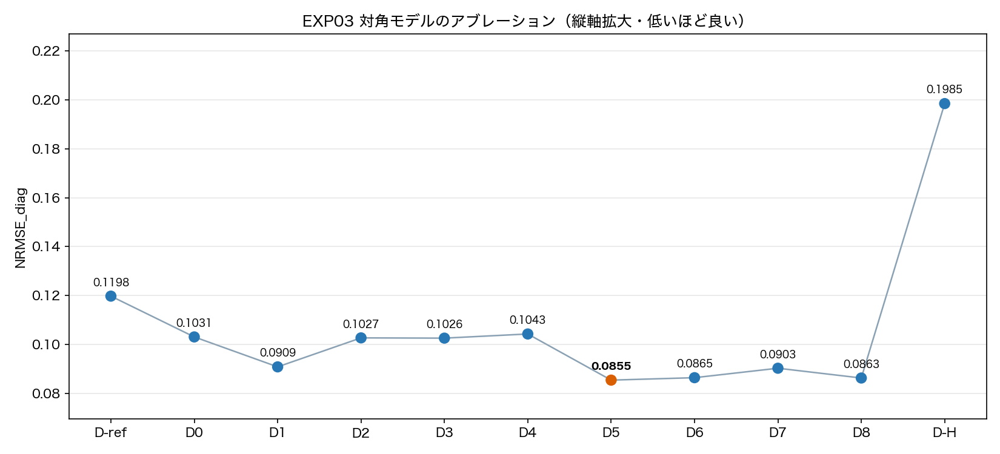
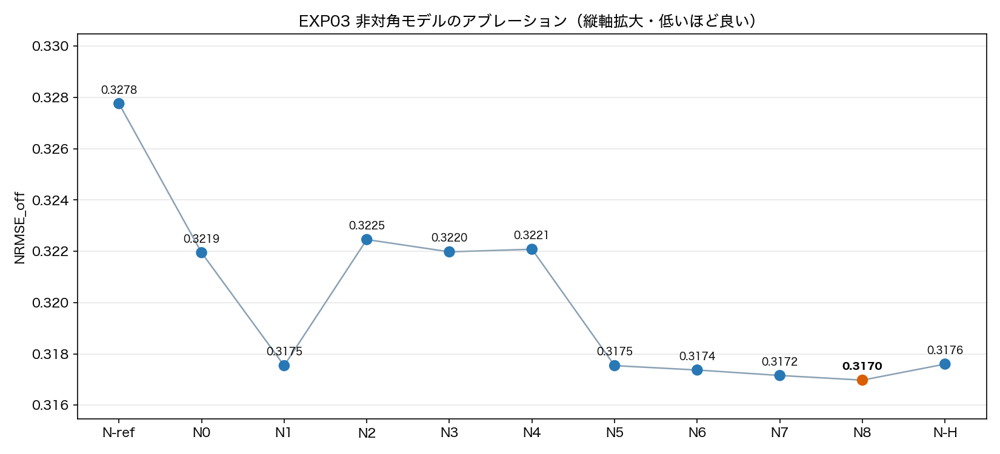
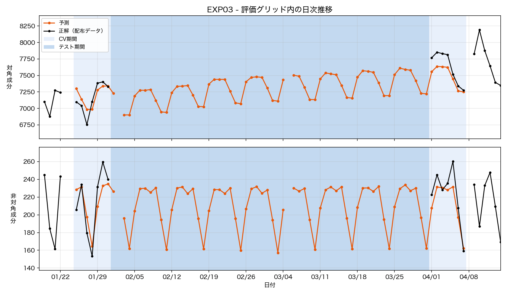
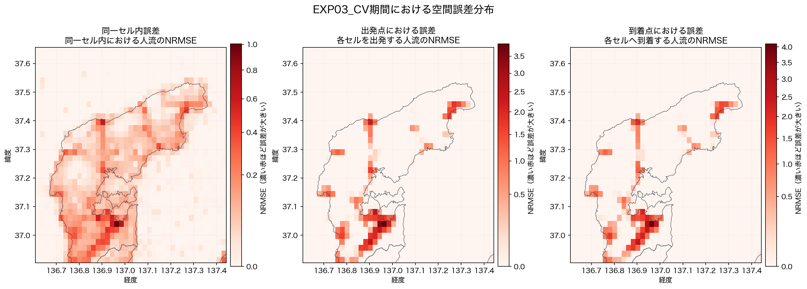

# EXP03 — 対角セル別状態空間と非対角「総量×配分」の補完

- **コード**: [`src/EXP03_run.py`](../../src/EXP03_run.py)
- **事前設計**: [`strategy.md`](strategy.md)
- **数値**: [`metrics.json`](metrics.json)
- **比較元**: EXP02
- **主な出力**: ローカル生成物 `outputs/submission.tsv`、公開集計
  [`municipality_errors.csv`](outputs/municipality_errors.csv),
  [`fit_diagnostics.csv`](outputs/fit_diagnostics.csv)
- **図**: [`diag_ablation_scores.png`](figures/diag_ablation_scores.png),
  [`off_ablation_scores.png`](figures/off_ablation_scores.png),
  [`EXP03_pred_dist.png`](figures/EXP03_pred_dist.png),
  [`local_error_map.png`](figures/local_error_map.png)
- **実行記録**: [`.log`](.log)

```bash
python3 src/EXP03_run.py
```

## 仮説

EXP02は非対角ODの出現率と出現時平均を使うことで0.2207まで改善したが、時系列の復興変化を
モデル化せず、対角も独立には学習していなかった。そこで、後側の観測も使える補完タスクの性質を
利用し、カルマンスムーザーで欠損期間の状態を推定する。

対角はセルごとに人流を直接学習する。非対角は、起点から出る総量と各destinationへの配分を
分けて学習する。避難者率・断水率・降水量・積雪・避難所施設数を加えれば、震災後の復旧過程に
伴う水準変化を観測ODだけの場合より説明できると考えた。さらに、状態空間モデルの残差を
CatBoostで学習し、線形モデルに残る非線形な関係が改善につながるか検証した。

## 手法

### Stage 1: 対角をセル別に直接補完

対角は「出発セルと到着セルが同じOD成分（`origin = destination`）」である。評価範囲の
1,476セルについて、1行を`日付 t × セル o`とする時系列を作り、その日の対角値を教師にした。

```text
元のODデータ
  → 日付×セルの対角系列Dを作る
  → 曜日・年末年始・セル対応の外部特徴を結合する
  → log1p(D)をセル別状態空間モデルで補完する
  → expm1で元尺度へ戻し、対角ODの予測値にする
```

```text
D[t,o] = y[t,o,o]
```

観測済みの日にOD辞書へ`o→o`がなければ`D=0`、日全体が`NA`なら欠損とした。ローカルCVの
14日も欠損として扱い、状態や係数の推定には使っていない。学習期間に一度も正値を持たない
セルは予測0とし、評価対象からは除外していない。

モデルへ入れた情報は次のとおり。外部特徴は候補ごとに追加して比較し、最終的に採用した`D5`では
避難者率・断水率・降水量を使用した。

| 入力 | セルへの付与方法 | モデル内での使い方 | D5 |
|---|---|---|---|
| 曜日 | 日付から作成。月曜を基準に火〜日の6列 | セルごとに異なる曜日係数 | 使用 |
| 年末年始 | 12月29日〜1月3日を1、それ以外を0 | セルごとの一時効果 | 使用 |
| 避難者率 | セルの所属市町について、当日以前の最新公表値 | 全セルで共有する係数＋セル別の係数偏差 | 使用 |
| 断水率 | セルの所属市町について、当日以前の最新公表値 | 全セルで共有する係数＋セル別の係数偏差 | 使用 |
| 降水量 | その日に値がある最寄り観測所をセルへ対応し、`log1p`変換 | 全セルで共有する係数＋セル別の係数偏差 | 使用 |
| 積雪 | その日に値がある最寄り観測所をセルへ対応し、`log1p`変換 | 全セルで共有する係数＋セル別の係数偏差 | 不使用 |
| 避難所 | `log1p(セル内施設数) × セル所属市町の避難者率` | 全セルで共有する係数＋セル別の係数偏差 | 不使用 |

避難者率・断水率は震災前を0とし、震災後の初回報告前や対象8市町外は欠損とした。欠損は
学習行だけから求めた平均で埋め、同時に`*_missing`フラグを加えた。その後、各特徴を学習行の
平均・標準偏差で標準化した。一定値になった特徴は除外した。補完値と標準化係数の推定には
CV14日を使わないが、CV当日の外部特徴そのものは予測日の説明変数として入力した。

目的変数には`log1p(D)`を使い、各セルに独立した時変水準`mu_D[t,o]`を持たせた。

```text
log1p(D[t,o]) = mu_D[t,o] + 曜日効果 + 外部特徴 + 観測誤差
mu_D[t,o]     = mu_D[t-1,o] + 状態ノイズ
```

状態ノイズ分散と観測誤差分散は対角系列全体で共有し、セルごとの水準・曜日係数・特徴係数偏差は
別に推定した。これにより、同じ市町のセルへ同じ避難者率・断水率が付いても、各セルの観測履歴と
反応の違いを残せる。係数・状態・分散はEMで交互推定し、前向きのカルマンフィルター後に、
欠損期間より後の観測も使うRTSスムーザーを適用した。

2024-01-01で状態を再初期化し、震災前の水準を震災後へ滑らかに直結していない。最後に
`expm1`で元の人流尺度へ戻して負値を0にし、その値を`y_hat[t,o,o]`とした。市町総量へ集約して
固定比率でセルへ戻す処理は行っていない。

```text
y_hat[t,o,o] = max(0, expm1(予測したlog水準))
```

### Stage 2: 非対角を総量と配分に分解

非対角を1本の回帰で直接予測すると、多数の0と少数の正値を同時に扱う必要がある。そこで、
「originから別セルへ出る人流の総量`O`」と「その総量を各destinationへ割り振る比率`r`」に
分けた。

```text
元の非対角ODデータ
  → 学習期間に出現した候補ODを決める
  → 日付×originの総量Oと、日付×ODの配分rに分解する
  → Oにはorigin特徴、rにはorigin・destination特徴を結合する
  → Oとrを別々の状態空間モデルで補完する
  → rをoriginごとに合計1へ正規化し、O×rで各ODを復元する
```

```text
O[t,o]   = Σ(d != o) y[t,o,d]
r[t,o,d] = y[t,o,d] / O[t,o]
y_hat[t,o,d] = O_hat[t,o] × r_hat[t,o,d]
```

まず、CV14日を除く観測期間で一度でも正値になった非対角ODの和集合を候補とした。今回の候補は
525ペアであり、検証日の正解から候補を追加していない。この候補集合を用いて、次の2種類の
学習表を作った。

| モデル | 1行の単位 | 教師 | 0と欠損の扱い |
|---|---|---|---|
| 総量モデル | `日付 t × origin o` | `O[t,o]` | 観測日に移動がなければ0。日全体が`NA`またはCV日なら欠損 |
| 配分モデル | `日付 t × origin o × destination d` | `r[t,o,d]` | `O>0`で当該ODがなければ0。`O=0`では比率を定義できないため欠損 |

#### 非対角総量 `O` の学習

`O`には`log1p`変換を適用し、originごとの時変水準と曜日効果を持つ状態空間モデルを当てた。

```text
log1p(O[t,o]) = mu_O[t,o] + origin別曜日効果 + 外部特徴 + 観測誤差
mu_O[t,o]     = mu_O[t-1,o] + 状態ノイズ
```

外部特徴にはorigin側の避難者率・断水率・降水量・積雪を入れた。避難所特徴は、静的な施設数を
そのまま足すのではなく、`log1p(origin施設数) × origin市町の避難者率`として、避難者率が高い
時期に避難所の多い起点で移動総量が変わるかを表した。採用した`N8`はこの5群をすべて使う。

総量モデルでは、時変水準、曜日係数、年末年始係数はorigin別、外部特徴の係数はorigin間で
共有した。前処理はStage 1と同じく、学習行だけによる平均補完、欠損フラグ、標準化である。
2024-01-01で状態を切り、RTSスムーザーで前後の観測から欠損日の`O_hat`を求め、`expm1`で
元尺度へ戻して非負化した。

#### 移動先配分 `r` の学習

各候補ODについて、`O[t,o]>0`の日だけ`r[t,o,d]`を教師とした。例えば、ある日にoriginの
非対角総量が10、destinationへの人流が2なら教師は0.2である。同じ日に候補ODが辞書に存在しない
場合は0として学習する。

```text
r[t,o,d]     = mu_r[t,o,d] + OD別曜日効果 + 外部特徴 + 観測誤差
mu_r[t,o,d]  = mu_r[t-1,o,d] + 状態ノイズ
```

配分には、originとdestinationの両方について避難者率・断水率・降水量・積雪を入れた。さらに
destination側の`log1p(避難所施設数)`、避難所の有無、
`log1p(destination施設数) × destination市町の避難者率`を追加した。これにより、同じorigin総量の
中で、外部状況と移動先の施設特性に応じてdestinationの配分が変わる形にした。これら外部特徴の
係数は候補OD間で共有し、時変水準、曜日係数、年末年始係数はODペア別に推定した。距離と
同一市町フラグは、後段のCatBoost残差補正には使ったが、このStage 2の状態空間モデルには
入れていない。

状態空間モデルが出した比率は、そのままでは負値やorigin別合計が1以外になり得る。そのため、
候補集合外のペアを0にし、候補内の負値を0へ丸めた後、日付×originごとに合計1へ
正規化した。正規化前の合計が0なら、学習期間全体の観測比率をfallbackとして使った。

```text
r_positive[t,o,d] = max(0, r_raw[t,o,d])
r_hat[t,o,d]      = r_positive[t,o,d] / Σ_d r_positive[t,o,d]
y_hat[t,o,d]      = O_hat[t,o] × r_hat[t,o,d]
```

したがって、各originについて復元した非対角人流の合計は`O_hat[t,o]`と一致する。`O`と`r`は
別々の状態・係数・状態ノイズ分散・観測誤差分散を持ち、対角モデルとも共有していない。候補の
採否は`O`や`r`単独の当てはまりではなく、積で復元した全非対角ODの公式NRMSE_offで決めた。

### Stage 3: 外部情報のアブレーション

使用した外部特徴は次の5群である。「water」は浸水率ではなく、既存データの断水世帯率を指す。

| 特徴群 | 対角 | 非対角総量 | 非対角配分 |
|---|---|---|---|
| 避難者率 `evac` | origin市町 | origin市町 | origin・destination市町 |
| 断水率 `water` | origin市町 | origin市町 | origin・destination市町 |
| 降水量 `rain` | セル最寄り観測所 | originセル | origin・destinationセル |
| 積雪 `snow` | セル最寄り観測所 | originセル | origin・destinationセル |
| 避難所 `shelter` | 施設数×避難者率 | origin施設数×避難者率 | destination施設数・同×避難者率 |

候補は外部情報なし、各特徴単独、単独で改善した特徴の組合せ、4特徴全部、避難所追加を比較した。
対角と非対角は別々の指標で候補を選んだ。

### Stage 4: CatBoost残差補正

CV14日を除く観測日を28暦日ブロック・5分割でcross-fittingし、同じ日の正解を見ていない
状態空間予測から残差教師を作った。CatBoostは状態空間予測、状態分散、欠損区間内の位置、
曜日・月、セルID、市町、距離、外部特徴を使い、対角 `D`、非対角総量 `O`、配分 `r` の残差を
学習した。反復数300、depth 5、learning rate 0.04、L2 10、seed 2026に固定し、CVによる
ハイパーパラメータ探索は行っていない。

## 検証設計

- 採点日は `jan` = 2024-01-25〜01-31、`apr` = 2024-04-01〜04-07の14日だけとした。
- CV正解14日は、状態空間の推定、外部特徴の前処理、CatBoostの残差教師から除外した。
- 2〜3月以降の観測も使用し、カルマンフィルターではなく前後の観測を使うカルマンスムーザーで補完した。
- 対角候補はNRMSE_diag、非対角候補は復元後のNRMSE_offをそれぞれ最小化した。
- 最終候補の主比較はEXP02のCombined NRMSE 0.2207とした。
- 候補選択と性能評価に同じ14日を使っているため、今回の値は独立な汎化性能ではない。

## 結果

### Stage 1: 対角モデル

| 候補 | 特徴群 | 状態 | NRMSE_diag | D0との差 | 判定 |
|---|---|---|---:|---:|---|
| `D-ref` | なし | 震災前後の固定水準 | 0.119783 | +0.016670 | - |
| `D0` | なし | 動的 | 0.103113 | 0.000000 | 基準 |
| `D1` | 避難者率 | 動的 | 0.090879 | -0.012234 | 改善 |
| `D2` | 断水率 | 動的 | 0.102721 | -0.000391 | 改善 |
| `D3` | 降水量 | 動的 | 0.102615 | -0.000497 | 改善 |
| `D4` | 積雪 | 動的 | 0.104317 | +0.001204 | 悪化 |
| **`D5`** | **避難者率・断水率・降水量** | **動的** | **0.085460** | **-0.017653** | **採用** |
| `D6` | 避難者率・断水率・降水量・積雪 | 動的 | 0.086457 | -0.016656 | - |
| `D7` | 避難者率・避難所 | 動的 | 0.090322 | -0.012791 | - |
| `D8` | 5特徴全部 | 動的 | 0.086324 | -0.016789 | - |
| `D-H` | D8＋CatBoost残差 | ハイブリッド | 0.198457 | +0.095344 | 不採用 |

外部情報なしの動的状態`D0`は固定水準`D-ref`より0.0167改善した。避難者率単独の改善が大きく、
断水率と降水量を合わせた`D5`が最良だった。積雪と避難所を含む`D8`も改善したが、`D5`には
届かなかった。

### Stage 2: 非対角モデル

| 候補 | 特徴群 | 状態 | NRMSE_off | N0との差 | 判定 |
|---|---|---|---:|---:|---|
| `N-ref` | なし | 震災前後の固定水準 | 0.327761 | +0.005812 | - |
| `N0` | なし | 動的 | 0.321949 | 0.000000 | 基準 |
| `N1` | 避難者率 | 動的 | 0.317542 | -0.004406 | 改善 |
| `N2` | 断水率 | 動的 | 0.322459 | +0.000511 | 悪化 |
| `N3` | 降水量 | 動的 | 0.321979 | +0.000031 | ほぼ同等 |
| `N4` | 積雪 | 動的 | 0.322081 | +0.000132 | ほぼ同等 |
| `N5` | 単独で改善した特徴 | 動的 | 0.317542 | -0.004406 | - |
| `N6` | 避難者率・断水率・降水量・積雪 | 動的 | 0.317372 | -0.004577 | - |
| `N7` | 避難者率・避難所 | 動的 | 0.317159 | -0.004790 | - |
| **`N8`** | **5特徴全部** | **動的** | **0.316977** | **-0.004971** | **採用** |
| `N-H` | N8＋CatBoost残差 | ハイブリッド | 0.317602 | -0.004346 | 不採用 |

非対角でも動的状態`N0`は固定水準`N-ref`より改善した。ただし外部特徴による改善幅は対角より
小さい。避難者率が主な改善要因で、5特徴を含む`N8`が最良だった。

#### 総量と配分の寄与

`N8`の総量・配分を外部情報なしモデルへ片側ずつ入れ替えた診断は次のとおり。

| 外部特徴を使う成分 | NRMSE_off | Combined（対角D5固定） |
|---|---:|---:|
| 総量のみ | **0.316958** | **0.201209** |
| 配分のみ | 0.322177 | 0.203818 |
| 総量＋配分 | 0.316977 | 0.201218 |

改善はほぼ総量モデルから生じた。配分だけを変更すると悪化し、総量だけの値は両方を使う値より
0.000019だけ良い。この差は小さいが、次の実験では「外部情報は総量、配分は外部情報なし」を
正式候補にする余地がある。

#### 避難所特徴の寄与

| 成分 | 避難所なし | 避難所あり | 差分 |
|---|---:|---:|---:|
| 対角：避難者率のみ | D1 0.090879 | D7 0.090322 | -0.000557 |
| 対角：4特徴 | D6 0.086457 | D8 0.086324 | -0.000133 |
| 非対角：避難者率のみ | N1 0.317542 | N7 0.317159 | -0.000384 |
| 非対角：4特徴 | N6 0.317372 | N8 0.316977 | -0.000395 |

避難所特徴は4つの対応比較ですべて小幅に改善した。ただし対角では、積雪と避難所を含まない
`D5`が最良である。避難所ヒートマップの情報は有用な兆候を示したが、今回のCVだけから因果効果
とは判断できない。

### Stage 3: 採用モデル

#### 統合・期間別スコア

| 窓 | 日数 | NRMSE_diag | NRMSE_off | **Combined NRMSE** | 全ゼロ予測比 |
|---|---:|---:|---:|---:|---:|
| **統合** | 14 | **0.0855** | **0.3170** | **0.2012** | 0.2096 |
| `jan` | 7 | 0.0904 | 0.3216 | 0.2060 | 0.2228 |
| `apr` | 7 | 0.0805 | 0.3124 | 0.1964 | 0.1972 |

EXP02との差は次のとおり。負値が改善を表す。

| 窓・成分 | EXP02 | EXP03 | 差分 |
|---|---:|---:|---:|
| **統合Combined** | 0.2207 | **0.2012** | **-0.0195** |
| `jan` Combined | 0.2318 | 0.2060 | -0.0258 |
| `apr` Combined | 0.2096 | 0.1964 | -0.0132 |
| 対角 | 0.1087 | **0.0855** | **-0.0232** |
| 非対角 | 0.3327 | **0.3170** | **-0.0157** |

統合スコアはEXP02より約8.8%低下した。1月・4月、対角・非対角のすべてで改善している。
対角の改善率は約21.4%、非対角は約4.7%で、今回の大きな差はセル別対角モデルから生じた。

#### 曜日別スコア

| 月 | 火 | 水 | 木 | 金 | 土 | 日 |
|---:|---:|---:|---:|---:|---:|---:|
| 0.2026 | 0.1999 | 0.1944 | 0.1993 | 0.2108 | 0.2129 | **0.1886** |

7曜日の最大は土曜0.2129、最小は日曜0.1886だった。平日0.2014、週末0.2007であり、平日と
週末の平均差は小さい。

#### 誤差の内訳

hit / miss / extra は二乗誤差の構成比であり、ペア件数の比率ではない。

| 成分 | hit | miss | extra | 正解ペア/日 | 予測ペア/日 |
|---|---:|---:|---:|---:|---:|
| 対角 | 98.40% | 0.10% | 1.50% | 381.9 | 732.2 |
| 非対角 | 69.63% | 3.36% | 27.01% | 118.4 | 402.9 |

EXP02の非対角はhit 63.17%、extra 33.35%だった。EXP03は予測ペア数を増やしながらhitを
6.46ポイント増やし、extraを6.34ポイント減らした。状態空間による小さい正値予測が増えたため、
対角の予測ペア数も多いが、extraの二乗誤差比は1.50%に収まった。

#### CatBoost残差補正

| 成分 | 状態空間のみ | CatBoost残差追加 | 差分 | 判定 |
|---|---:|---:|---:|---|
| 対角 | **0.085460** | 0.198457 | +0.112997 | 不採用 |
| 非対角 | **0.316977** | 0.317602 | +0.000625 | 不採用 |

CatBoostは両成分で改善しなかった。特に対角の悪化が大きい。28日ブロックで作った残差教師と、
1月・4月のCV欠損条件が一致していない可能性、セルIDを含む残差モデルがcross-fitting期間へ
過適合した可能性がある。この残差教師・特徴・固定ハイパーパラメータの構成を不採用とした。

## 誤差分析

14日統合の地域別NRMSEと、全ゼロ予測に対するSSE比を示す。非対角は起点別と終点別の同じ誤差を
異なる方向から集計したもので、両者を足し合わせない。NRMSEは地域の人流規模にも依存するため、
地域内での難しさは`SSE/Σy²`で確認する。

| 地域 | セル | 対角 NRMSE | 対角 SSE/Σy² | 非対角 NRMSE（起点/終点） | 非対角 SSE/Σy²（起点/終点） |
|---|---:|---:|---:|---:|---:|
| 七尾市 | 123 | 0.1873 | **0.005** | 0.7720 / 0.7659 | **0.072 / 0.072** |
| 珠洲市 | 107 | 0.0838 | 0.026 | 0.3626 / 0.3626 | 0.201 / 0.201 |
| 穴水町 | 63 | 0.0866 | 0.018 | 0.2440 / 0.2494 | 0.281 / 0.287 |
| 能登町 | 89 | 0.0915 | 0.016 | 0.1324 / 0.1325 | 0.979 / 0.979 |
| 輪島市 | 154 | 0.0860 | 0.007 | 0.2785 / 0.2769 | 0.090 / 0.089 |
| 志賀町 | 85 | 0.1202 | 0.016 | 0.3717 / 0.3717 | 0.245 / 0.245 |
| 中能登町 | 20 | 0.2250 | 0.009 | 1.1316 / 1.1642 | 0.223 / 0.222 |
| 羽咋市 | 20 | 0.1752 | 0.023 | 0.4071 / 0.3837 | 0.552 / 0.526 |
| 対象8市町外・富山県 | 815 | 0.0155 | 0.025 | 0.0010 / 0.0010 | — |
| **全体** | **1,476** | **0.0855** | **0.008** | **0.3170 / 0.3170** | **0.105 / 0.105** |

中能登町は非対角NRMSEが大きいが、セル数20で正規化分母も小さい。`SSE/Σy²`は0.223であり、
全ゼロより十分良い。能登町は0.979で全ゼロとほぼ同等で、相対精度の改善余地が最も明確である。
七尾市はNRMSEが大きく見える一方、`SSE/Σy²`は8市町で最小だった。

## 図と考察

### `figures/diag_ablation_scores.png`



D5が0.0855で明確に最良で、全特徴を入れたD8は0.0863とわずかに劣る。特徴を増やせば単調に
改善するわけではなく、避難者率・断水率・降水量の組み合わせがこのCVでは十分だった。
D-Hは0.1985まで悪化しており、固定したCatBoost残差補正の不安定さも図から際立つ。

### `figures/off_ablation_scores.png`



N8が0.3170で最良だが、N6・N7との差は小さく、外部特徴追加の改善は頭打ちに近い。N-Hも
0.3176へ悪化しており、非対角では残差補正の害は小さいものの採用する根拠はない。対角図との
比較から、EXP03の改善幅は主に対角モデルで生じたことが分かる。

### `figures/EXP03_pred_dist.png`



1月・4月とも週次の上下方向は概ね追えているが、予測は正解より滑らかで低めに寄る。特に4月
初旬は対角総量を過小予測し、非対角でも正解の上振れを取り切れていない。状態空間モデルは
周期と中期水準を安定して補完する一方、日単位の急変には追随しにくい。

### `figures/local_error_map.png`



対角の色尺度上限はEXP02より低下し、セル別対角モデルの改善が空間的にも確認できる。非対角は
南部と沿岸部の高誤差セルが残り、起点・終点で似た分布を示す。避難所施設数が多い地域と一部
重なるが、避難所特徴の改善幅は小さく、施設数だけで残差を説明することはできない。

## 解釈

今回確認できた主な結果は、対角と非対角を別々に設計する効果である。EXP02では対角が非対角を
引いた余りだったが、EXP03はセル別対角系列を直接補完した。これにより対角NRMSEが0.1087から
0.0855へ改善した。

外部情報では避難者率が最も安定して効いた。対角は避難者率単独で0.1031から0.0909、非対角は
0.3219から0.3175へ改善した。断水率と降水量は対角で避難者率と組み合わせたときに追加改善した。
積雪単独は両成分で悪化したが、非対角では他の特徴と避難所を含む全特徴候補が最良だった。

非対角の分解診断では、外部情報の効果は配分より総量に集中した。現段階では、復旧情報を
「どこへ行くか」より「別セルへの移動が全体としてどれだけ起きるか」に使う方がデータと整合する。

## 失敗した試み

### CatBoost残差補正

対角は0.0855から0.1985へ大きく悪化し、非対角も0.3170から0.3176へ悪化した。残差補正は
採用しない。次に試す場合は、欠損長を本番60日に近づけた残差教師、対角セルごとの補正上限、
時系列ブロックを完全に分離した評価が必要である。

### 積雪の単独追加

対角はD0 0.1031からD4 0.1043、非対角はN0 0.3219からN4 0.3221へ悪化した。積雪は単独特徴
として採用しない。ただしN8全体では最良なので、積雪だけの効果と特徴間の相互作用は分離できていない。

### 配分だけへの外部情報

非対角の配分だけをN8へ変えると0.3222で、N0の0.3219より悪化した。外部情報を配分へ入れる
設計は、このCVでは支持されなかった。

## 採否判定

**対角D5、非対角N8の状態空間モデルを採用候補とする。CatBoost残差補正は両成分で不採用。**

Combined NRMSEは0.2012で、EXP02の0.2207より0.0195、相対で約8.8%改善した。1月・4月の
両窓で改善し、対角・非対角もともに改善したため、次の比較基準として使用できる。

## 制約・未解決

- 14日CVを特徴候補の選択にも使ったため、0.2012は独立なテスト性能ではない。
- 状態空間の実学習28件中25件が200反復上限に達し、収束判定を満たしていない。採用したD5、
  N8の総量・配分も未収束であり、固定200反復時点の比較として扱う。
- N8配分の最大状態分散は約10,000で、初期分散付近に残る系列がある。最終配分は非負化と
  origin別正規化を通しているが、疎なODの状態推定は不安定である。
- 正規化前のN8配分は20.96%が負値で、1,288 origin日で観測fallbackを使用した。非負化・
  正規化への依存が大きい。
- `log1p`からの復元は`expm1`による中央値で、状態分散を使った平均補正は行っていない。
- CatBoostの内部欠損は28日ブロックで、本番の約60日欠損やCV窓の条件と異なる。
- 本番`submission.tsv`は58日分を生成し、日付・ID・構造・負値の形式検査を通過した。本番スコアは
  正解非公開のため確認できない。
