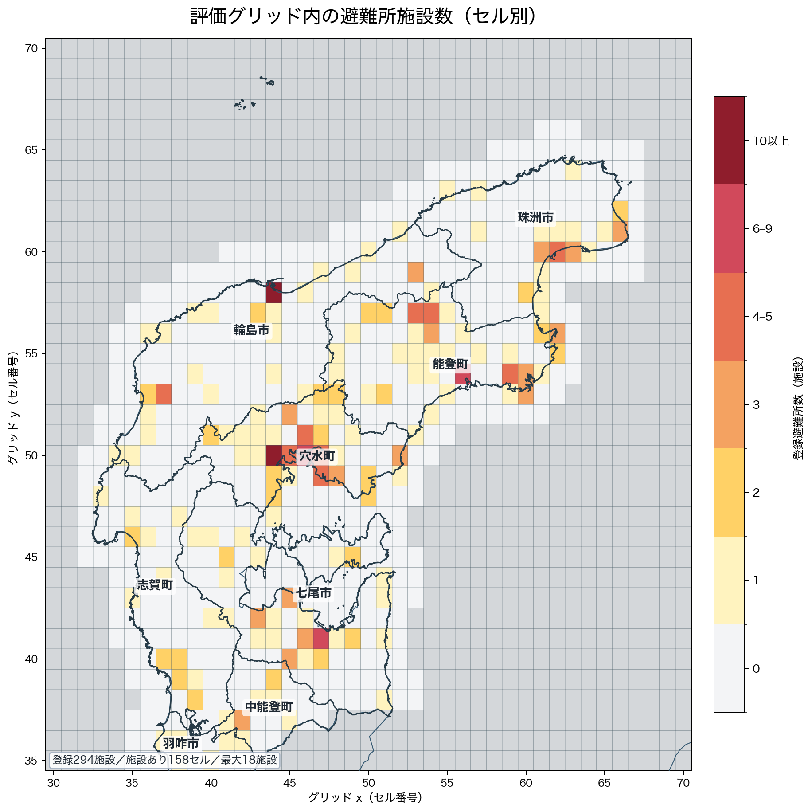

# EXP03 — 避難・断水・気象を使う対角／非対角の状態空間＋CatBoost残差モデル

## 今回の設計変更

**対角はセルごとの人流を直接学習する。対角と非対角で、学習・外部特徴の採否・モデル選択を分ける。非対角は「総量×配分」を維持する。**

旧案の「断水率で市町別対角だけを補正し、非対角をEXP02に固定する」設計を変更する。
避難者率・断水率・降水量・積雪に加え、セル別の避難所施設数を両モデルの入力候補とし、
それぞれの効果を実験で測る。
「水害率」はここでは既存CSVの**断水世帯率**を指す。浸水率・洪水被害率のデータではない。

EXP02は精度比較の対象とし、その予測・出現率・平均値を新モデルの入力や補正先には使わない。
非対角の配分fallbackが必要な場合も、マスク後の観測ODからEXP03内で新しく集計する。

本ファイルは実装の事前設計と固定設定を記録する。実装は[src/EXP03_run.py](../../src/EXP03_run.py)、
実行結果と採否は[report.md](report.md)を参照する。
旧案にあった事前相関・回帰値だけで気象や避難者率を不採用にしない。
数値・結果は実行後に[metrics.json](metrics.json)・[report.md](report.md)へ記録する。

## 目的

1. 復興に伴う水準の変化を、前後の観測と公開外部情報から補完する。
2. 避難・断水・気象が、対角と非対角のどちらを改善するか区別する。
3. 非対角では「移動総量」と「行き先の配分」のどちらに情報が効くか調べる。
4. 避難者率の変化が、避難所の多いセルと少ないセルで異なる人流変化を生むか調べる。
5. 状態空間モデルが捉えた滑らかな水準からの残差をCatBoostで補正し、非線形な復旧条件が
   追加の予測情報を持つか調べる。

これは2〜3月を未来へ向かって予測するだけのタスクではない。
後側の4月以降の観測も使って、カルマンスムーザーで欠損期間を推定する。

## 全体構成

```text
観測OD（CV正解を先にマスク）＋公開外部情報
  ├─ 対角モデル
  │    セル別の対角人流 D[t,o] = y[t,o,o] を学習
  │    セルごとの状態を平滑化
  │    → 対角人流 y_hat[t,o,o] を直接推定
  │
  └─ 非対角モデル
       origin別の移動総量 O[t,o] を学習
       × 移動先配分 r[t,o,d] を学習
       → 非対角人流 y_hat[t,o,d]

各成分で状態空間単独とCatBoost残差補正を比較
対角最良候補＋非対角最良候補を結合 → 最終OD・公式スコア
```

| 項目 | 対角モデル | 非対角モデル |
|---|---|---|
| 主な学習単位 | 日付×セル（origin＝destination） | 日付×origin、日付×origin×destination |
| 目的変数 | セル別の対角人流 | origin別非対角総量、条件付き移動先比率 |
| 外部情報 | 所属市町の避難者率・断水率、対象セルの気象 | 起点・終点の避難者率・断水率・気象 |
| 選択指標 | NRMSE_diag | 復元後のNRMSE_off |
| 特徴の採否 | 対角だけで決める | 非対角だけで決める |
| 状態・係数・分散 | 対角側で推定 | 非対角側で別に推定 |

同じ特徴が両方で効くことは前提にしない。
例えば「対角は断水＋積雪、非対角は避難＋雨」という採用も許す。

## 対角モデル

### 学習する量

各評価セルoについて、日付×セルを一行とし、次の人流を直接の教師とする。

```text
D[t,o] = y[t,o,o]
y_hat[t,o,o] = D_hat[t,o]
```

各セルに独立した時変の水準を持たせ、同じ市町内でも異なる増減を学習できるようにする。
市町別の対角総量への集約、市町内の固定配分qによる再分配は行わない。
市町名は外部情報の対応付けと誤差集計に使い、対角の学習単位にはしない。

市町対応は既存セルマップを使い、8市町に属さない評価セルも落とさない。
これらもセルごとの系列として学習し、外部の市町率は欠損として扱う。
セルごとに有効観測数・正値日数・平均・分散・市町対応を保存する。
学習期間の有効観測がすべて0のセルは予測0とし、評価対象には残す。
全日欠損は全日0と区別し、該当があれば推定不能として記録して処理方針を確認する。

### 状態空間モデル

```text
log1p(D[t,o]) = mu_D[t,o] + weekday_D[o,w] + beta_D[o] · x_D[t,o] + eps_D[t,o]
mu_D[t,o]    = mu_D[t-1,o] + eta_D[t,o]
```

状態・曜日効果・予測はセルごとに持つ。外部係数は対角モデル内の共通係数とセル別偏差に分け、
偏差をL2正則化して観測の少ないセルでの過学習を抑える。初回の状態ノイズ・観測ノイズ分散は
対角系列間で共有し、セルごとの状態は別々に推定する。非対角側とは係数・分散を共有しない。
これはパラメータの推定を安定させるための共有であり、目的変数を市町へ集約する処理ではない。
係数の符号は固定せず、予測上の関連として学習する。log1pから復元し、非負の対角予測を得る。

同じ市町のセルには同じ避難者率・断水率が付くが、セル自身の観測履歴・状態・係数と
セルに対応する気象を使うため、市町内の人流比率を一定に保つ制約はない。

### 避難所特徴

セルoの登録避難所数を `facility_count[o]` とし、次を定義する。

```text
F[o] = log1p(facility_count[o])
H[o] = 1(facility_count[o] > 0)
S_D[t,o] = F[o] × evacuee_rate[t, municipality(o)]
```

FとHは時間によらないため、セル別状態を持つ対角モデルではセルの基礎水準と重なりやすい。
対角モデルの主な追加特徴は、時間変化する避難者率との相互作用S_Dとする。
これにより、市町の避難者率が変化したとき、避難所が多いセルだけ対角人流の反応が異なるかを
共通係数と正則化したセル別偏差で学習する。避難所の多いセルへ人流を強制配分しない。

## 非対角モデル：総量×配分

### 順方向の定義

評価域内のorigin・destinationについて、

```text
O[t,o]   = Σ(d != o) y[t,o,d]
r[t,o,d] = y[t,o,d] / O[t,o]
y_hat[t,o,d] = O_hat[t,o] × r_hat[t,o,d]
```

とする。Oは「その起点から評価域内の別セルへ流れる量」であり、全域の行合計とは区別する。
Oは対角の残差から作らず、非対角観測から独立に学習する。

### 後続実験

出発側・到着側の分解と1:1結合の比較は、[EXP04の計画](../EXP04/strategy.md)へ移した。
EXP03の実装・記録値は出発側の総量×配分モデルを表す。

### 総量モデル

```text
log1p(O[t,o]) = mu_O[t,o] + weekday_O[o,w] + beta_O · x_O[t,o] + eps_O
mu_O[t,o]    = mu_O[t-1,o] + eta_O
```

起点の避難者率・断水率・降水量・積雪を入力する。
避難所特徴候補では、起点セルの `F[o] × evacuee_rate[t, municipality(o)]` を加える。
起点別の水準を持ち、係数と分散は系列間で共有・正則化し、疎な起点でも推定を安定させる。
対角モデルの係数・分散・特徴の採否は流用しない。

### 配分モデル

```text
r[t,o,d]  = mu_r[t,o,d] + weekday_r[o,d,w] + beta_r · x_r[t,o,d] + eps_r
mu_r[t,o,d] = mu_r[t-1,o,d] + eta_r
```

入力は起点・終点それぞれの避難者率・断水率・降水量・積雪。
避難所特徴候補では、destinationのF・Hと
`F[d] × evacuee_rate[t, municipality(d)]` を移動先の魅力度を表す説明変数として加える。
F・Hの係数は学習し、施設の有無で比率を固定したり0へ落としたりしない。
ODごとに外部係数をすべて独立推定せず、配分モデル内で共有・正則化する。
総量モデルとも係数・分散を分ける。

線形ガウスモデルによる比率の近似として始め、平滑化推定後に非負化し、originごとに正規化する。
負値の発生率・正規化前の比率和・修正量を保存する。

正規化分母が0なら、マスク後観測の `Σ_t y[t,o,d] / Σ_t O[t,o]` へ戻す。
その分母も0、または候補destinationがなければ、その起点の非対角予測を0とする。

rの誤差だけで採用を決めず、必ずO_hat×r_hatを復元してNRMSE_offを測る。
総量と配分を合わせて一つの「非対角候補」として選択する。

## 外部情報の定義とパス

| 情報 | 使用CSV・列 | 対角 | 非対角総量 | 非対角配分 |
|---|---|---|---|---|
| 避難者率 | `data/processed/避難者率/市町別避難者率.csv` の `避難者率` | 所属市町の率をセルへ付与 | 起点市町 | 起点・終点市町 |
| 断水率 | `data/processed/断水率/市町別断水率.csv` の `断水世帯率` | 所属市町の率をセルへ付与 | 起点市町 | 起点・終点市町 |
| 降水量 | `data/processed/weather/weather.csv` の `precipitation_total_mm` | 対象セルの最寄り観測値 | 起点セル | 起点・終点セル |
| 積雪 | 同CSVの `snow_depth_max_cm` | 対象セルの最寄り観測値 | 起点セル | 起点・終点セル |
| 市町対応 | `data/processed/events/population_cell_map.csv` | 外部情報対応・誤差集計 | 起点対応 | 起点・終点対応 |
| 避難所マップ | `data/processed/避難所/避難所_セル別集計.csv` の `facility_count` | 施設数×避難者率 | 起点施設数×避難者率 | 終点施設数・有無、終点施設数×避難者率 |

避難者率の分母は人口、断水率の分母は世帯数。率を同一の意味として足し合わせない。
既存の2次避難者数は別の量であり、市町別避難者率に合算しない。初回の追加特徴にはしない。

気象は、各日・項目ごとに値がある最寄り観測所をセルへ対応付ける。
対角にもセルごとの観測値を直接付与し、市町代表値への集約や人流による重み付けは行わない。
降水量・積雪はセルへ対応付けた値をlog1p変換する。

### 時間結合と欠損

- 市町率は当日以前の最新報告を使用する。公表日間を未来の報告で線形補間する処理は初回では行わない。
- 震災前の当該震災による負担は0と仮定する。市町不明・対象外セルの率は欠損のままにする。
- 震災後の初回報告前・未報告は欠損。最新報告が欠損なら、さらに古い有効値で黙って置換しない。
- 報告日、経過日数、最終報告以降の持ち越しを保存する。
- 気象観測がないことを降水0・積雪0にしない。対応観測所・距離・品質情報を保存する。
- モデルの説明変数に残る欠損は、学習行だけから求めた平均で埋め、欠損フラグを加える。
  定数列・全欠損列は落とし、処理を記録する。
- 100%を超える断水率は出典・分母の不整合を確認し、無条件に1へクリップしない。

避難所CSVからは登録施設の所在を表す `facility_count` だけを使用する。
開設・閉鎖状態や収容人数を静的施設数へ混ぜない。F・Hは欠損させず、施設登録のない評価セルを0とする。
施設数単独で高人流セルを決め打ちせず、対角では避難者率との相互作用、非対角では学習された
destination魅力度として使う。周辺3×3セルの施設数と最寄り避難所距離は、初回の探索対象に含めない。

EXP02の固定予測に対して避難所なしdestinationだけを一律に縮小した診断では改善しなかったため、
[既存診断](../EXP02/outputs/shelter_reweight/report.md)と同じハード補正は候補にしない。

### データの図

外部特徴量の元データと、そのデータから生成した図は公開リポジトリに含めない。
避難所のセル分布だけは、実験説明に必要な生成図として `figures/` に残す。



## 学習・平滑化の共通方針

- 大会規定はローカルの `Competition.md` で確認し、評価とCVの実装は[src/common](../../src/common/README.md)を正とする。大会規定そのものは公開リポジトリに含めない。
- 全日付を連続した日次軸へ並べる。NA・テスト期間・CV日は行を消さず、目的変数だけ欠損にする。
- 2024-01-01に水準の状態を再初期化し、震災前後を同じ滑らかな状態で結ばない。
- 水準はまずランダムウォークとし、局所線形トレンドや多数のラグは初回では加えない。
- 曜日効果を基本モデルに含める。年末年始の一時的な増減は、事前に定義した日付ダミーを
  対角・非対角の基本モデルに共通で入れる。日付範囲は12/29〜1/3に固定する。
- 特徴の尺度と正則化は学習データだけで決める。対角・総量・配分で別の係数・分散を持つ。
- 避難所のF・Hは静的公開情報として固定し、避難者率との積は日付を結合した後に作る。
  CV正解の人流や誤差から相互作用の値・重みを作らない。
- 係数と状態を同じ観測尤度の下で推定する。固定切片の単純回帰を先に行い、その残差だけを
  別目的で平滑化する実装にはしない。
- 分散は観測尤度、係数は必要に応じてL2罰則を含む尤度で推定する。
  推定アルゴリズム・標準化・罰則の尺度・初期値・停止基準は実装前に固定して記録する。
- 正解がない日は観測更新を飛ばす。学習後に後ろ向きの平滑化を行う。
  forward filterでは水準が水平に伝播しても、両側の観測を使う平滑化結果が水平になるとは限らない。
- log1pからの復元は、平滑化平均と分散を使う平均補正の有無を明示する。
  状態の不確実性と観測ノイズを区別し、巨大な分散による人流の膨張を監査する。
- 尤度の向上だけで採用しない。変換を戻し、比率を正規化した最終ODで評価する。

## CatBoostによる残差補正

状態空間モデルは、前後の観測を使った滑らかな水準・曜日効果・線形な外部効果を担当する。
CatBoostはその予測を置き換えず、状態空間モデルだけでは残った非線形な誤差を補正する。
完成予測を直接CatBoostだけで学習する候補は、このアブレーションには含めない。

ここでいうカルマンモデルは、欠損期間の後側の観測も使う**カルマンスムーザー**である。
フィルターは過去から未来への推定、スムーザーはその後に未来側の観測を使って過去の状態も更新する。
2〜3月の補完にはスムーザーの推定値を基準予測として使う。

### 残差教師

各状態空間候補の元スケール予測を `D_ss`、`O_ss`、`r_ss` とし、CatBoostの教師を次とする。

```text
e_D[t,o]   = D[t,o]   - D_ss[t,o]
e_O[t,o]   = O[t,o]   - O_ss[t,o]
e_r[t,o,d] = r[t,o,d] - r_ss[t,o,d]
```

同じ日の正解を観測した平滑化値から残差を作ると、状態が正解を見た後の小さな残差になり、
本番の欠損期間と条件が異なる。そこで、CV14日を除いた観測日を決定的な日付ブロックに分け、
各ブロックを一時的にマスクして状態空間予測を作る。マスクされた行の残差だけを連結し、
CatBoostの学習教師とする。このcross-fittingは教師生成だけに使い、スコア評価・特徴選択・
ハイパーパラメータ選択には使用しない。評価期間は指定14日のままとする。

ブロック分割数・日付境界・乱数seedは実装前に固定する。各ブロックでは連続日をまとめて隠し、
欠損補完時の条件へ近づける。CV14日の正解は、どのcross-fitting学習にも含めない。

### 初回実装の固定設定

- 日次軸は2023-11-01〜2024-10-31。初期状態は平均0・分散10,000とし、震災日に再初期化する。
- 状態・回帰係数・分散は罰則付き観測尤度に基づくEMで交互更新する。最大200反復、
  罰則付き観測負対数尤度の相対変化1e-5を停止基準とし、未収束を診断CSVへ記録する。
  初期回帰係数はマスク後観測の震災前・後の系列平均を引いて推定し、外部係数に基礎水準を吸収させない。
- 状態分散Qの初期値は観測残差分散Rの0.03倍。Q・Rの下限は1e-8。
  曜日係数と共通外部係数のL2係数は1、対角のセル別外部係数偏差は20。
  固定水準対照の震災前・後切片はL2係数1e-6とする。
- log1pからはexpm1で復元し、初回は分散による平均補正を加えない。中央値の復元であることを
  結果解釈に残す。CatBoostはこの元スケール予測との差を学習する。
- 内部分割は2023-11-01を起点に28暦日ずつ区切り、ブロック番号mod 5で5分割する。
  各foldで候補OD・配分fallback・特徴標準化・状態空間係数・Q・Rを再推定する。
  内部マスクはCV追加ではなく残差教師生成で、採点しない。
- CatBoostはCPU、300反復、depth=5、learning_rate=0.04、l2_leaf_reg=10、seed=2026、4スレッド。
  CatBoostの欠損数値はNaNで渡し、カテゴリの欠損は「対象外」として明示する。
- 比率の残差基準は、状態空間予測を非負化・正規化したrとする。
  O²重みは最終人流の二乗誤差の近似であり、日次RMSE平均・総量推定誤差・再正規化まで含む
  公式目的関数と同一ではない。採否は必ず復元後の公式指標で決める。

### 特徴量と復元

CatBoostには次を入力する。

- 基準となる状態空間予測、平滑化分散、直前・直後の観測日までの日数、欠損区間内の相対位置。
- 曜日、月、震災からの日数、年末年始フラグ。
- セルID・市町名。非対角配分ではorigin ID・destination ID・同一市町フラグ・セル間距離。
- 避難者率、断水率、降水量、積雪、避難所F・H、および事前に定義した避難所×避難者率。

セル・origin・destination・市町名はカテゴリ特徴として渡す。
欠損区間の正解から作るラグ、移動平均、当日総量は使わない。

```text
D_hybrid[t,o] = max(0, D_ss[t,o] + Cat_D(features[t,o]))
O_hybrid[t,o] = max(0, O_ss[t,o] + Cat_O(features[t,o]))
r_raw[t,o,d]  = r_ss[t,o,d] + Cat_r(features[t,o,d])
r_hybrid      = max(0, r_raw) をoriginごとに和1へ正規化
y_hybrid[t,o,d] = O_hybrid[t,o] × r_hybrid[t,o,d]
```

Cat_DとCat_Oは元スケールの残差をRMSEで学習し、公式指標の二乗誤差に近づける。
Cat_rはOが大きい日の配分誤差が最終人流へ強く影響するため、学習行を `O[t,o]^2` で重み付けする。
O=0の日は従来どおりrの教師にしない。補正後の負値率・クリップ量・比率の再正規化量を保存する。

CatBoostのdepth・学習率・反復数・L2正則化・seedは一組に固定し、14日CVによる探索やearly stoppingを
行わない。これにより、この段階で比較する差を「残差モデルの有無」に限定する。

## 観測期間とCV

CVは**2024-01-25〜01-31、04-01〜04-07の14日だけ**とする。
旧案にあった4〜5月の合成ギャップや別期間の補助CVは実行しない。

学習は配布された前後の観測日を使用する。CV正解14日を先に除き、その後に以下を作る。

- セル別対角人流、origin別非対角総量、配分教師。
- 非対角候補OD、配分fallback、セル別の観測統計。
- 特徴の平均・標準偏差・欠損処理、状態と外部係数。

提出時は指定14日のマスクを解除し、全観測日で再学習・再集計する。
2〜3月当日の公開外部情報、4月以降の観測ODを使用してよい。

観測日の辞書にないODは評価データ上の0、日全体のNAは欠損とする。
O=0の日はOの教師0、rの教師欠損。O>0なら未出現destinationのrは0とする。
候補ODは学習観測の正の非対角ODの和集合とし、曜日ごとに候補集合を変えない。

## 外部情報のアブレーションを別々に実行する

以下を対角D系列と非対角N系列でそれぞれ実行する。
非対角候補内では、追加群を総量モデルと配分モデルへ各々対応する形で入力する。

| 対角ID | 非対角ID | 特徴・モデル | 主に比較する相手 |
|---|---|---|---|
| D-ref | N-ref | 震災前後の固定水準＋曜日・年末年始 | 時変モデルの対照 |
| D0 | N0 | 状態空間＋曜日・年末年始、外部情報なし | 固定水準モデル |
| D1 | N1 | 各0＋避難者率 | 各0 |
| D2 | N2 | 各0＋断水率 | 各0 |
| D3 | N3 | 各0＋降水量 | 各0 |
| D4 | N4 | 各0＋積雪 | 各0 |
| D5 | N5 | 各1〜4で改善した群を統合 | 各0 |
| D6 | N6 | 避難・断水・降水・積雪の全群 | 各0 |
| D7 | N7 | 各1＋避難所特徴群 | 各1（避難者率単独） |
| D8 | N8 | 各6＋避難所特徴群 | 各6（全外部情報） |
| D-H | N-H | 各成分の最良状態空間候補＋CatBoost残差補正 | 補正元の最良状態空間候補 |

状態空間候補は最大10候補ずつ。D5の改善群はNRMSE_diag、N5の改善群は復元したNRMSE_offで独立に選ぶ。
D7/N7は避難所相互作用の追加価値を避難者率単独と比較し、D8/N8は全特徴へ加えた場合を確認する。
主効果を欠いた相互作用にしないため、避難所相互作用だけをD0/N0へ加える候補は作らない。
対角はD-refを含む全候補で同じセル別の目的変数を使う。
採用候補は全評価セルのNRMSE_diagで一つ選び、セルごとに14日CVの最良特徴を選ぶ探索は行わない。
同じ入力になる候補は再学習せず、再利用元を記録する。
初回では祝日・年末年始ダミーの細かい選択や、特徴のラグ探索を同時に増やさない。
D-H/N-Hは、それぞれD-ref〜D8、N-ref〜N8から選んだ最良状態空間候補を補正元とする。
残差補正後が補正元を改善した場合だけ採用し、CatBoostを必須にはしない。

### 非対角のどこに効いたか

N1〜N8について、再学習せず次を比較する。

1. 候補のO＋N0のr。
2. N0のO＋候補のr。
3. 候補のO＋候補のr。

これらのNRMSE_offを出し、総量への効果と移動先への効果を区別する。
入れ替え診断を新しい採用候補へ自動追加しない。

N-Hでは追加で、同じ学習済みモデルから次を復元してNRMSE_offを比較する。

1. CatBoostでOだけを補正し、rは補正元のまま。
2. Oは補正元のまま、CatBoostでrだけを補正。
3. Oとrを両方補正。

これは残差補正が非対角総量と配分のどちらに効いたかを確認する診断であり、
三つから別の採用候補を選ぶ探索にはしない。N-Hの事前定義はOとrを両方補正した3とする。

## 最終選択と結合

1. D-ref〜D8の最良候補とD-Hから、14日平均NRMSE_diagが小さい方を選ぶ。
2. N-ref〜N8の最良候補とN-Hから、14日平均NRMSE_offが小さい方を選ぶ。
3. 二つの予測を結合し、公式Combined NRMSE・jan/aprを再計算する。

Combinedは対角・非対角NRMSEの単純平均なので、両者にまたがる後処理がなければ
それぞれを最小化した組合せが候補集合内で最良となる。
同点の許容差は1e-12。特徴数が少ない方、次に状態の簡単な方、最後に表の順で選ぶ。

対角を非対角総量の残差にしたり、片方の予測を他方から差し引いたりしない。
評価域内の対角・非対角を一括で一定総量へ再正規化する処理も初回では入れない。
これにより、対角側の設定変更が非対角スコアを変えないことを保証する。
配布データ全域の総量の一定性は診断として記録し、人口や公式評価の正規化定数とは区別する。

評価域外・評価域をまたぐODは、マスク後の震災後観測から新規集計する同曜日平均で補う。
この補完は全候補で固定する。提出形式の検査と日次総量の診断を分け、総量変化を隠さない。

## 評価・採否・確認

- 対角／非対角の候補別スコア、最終Combined、jan/apr、日別を保存する。
- セル別対角バイアス・RMSE、市町別に集計した対角バイアス、起点・終点市町別SSE、
  hit/miss/extra、施設数別誤差を確認する。市町集計は診断だけに使う。
- 外部情報の回帰係数だけで採否を決めず、候補間の予測誤差差を見る。
  符号が期待と逆でも直ちに無意味と断定しない。因果効果ではない。
- 断水・避難・天候が観測水準に対してどの程度追加情報を持つかは、実験後に判断する。
- 避難所特徴はD7対D1、N7対N1、D8対D6、N8対N6の差で採否を決める。
  施設数別の絶対誤差が大きいことだけを有効性の根拠にせず、施設数別の実人流RMSと相対誤差も保存する。
- 避難所ありdestinationへの配分が増減した量と、その変化による非対角hit/miss/extraの差を保存する。
- CatBoost残差補正は補正元との差を対角・非対角で別々に測る。学習内RMSEでは採用しない。
- cross-fittingの各行で、その日の正解が状態空間入力から除外されていることを検査する。
  CV14日の行が残差教師・CatBoostのカテゴリ統計・early stoppingへ入らないことも検査する。
- CatBoost補正量を日付・セル・施設数・市町・残差符号別に保存し、少数セルへの極端な補正を確認する。
- CV正解を改変しても、学習入力・観測統計・候補・配分fallback・予測が変わらないことを検査する。
- 同じ市町の複数セルで異なる時系列を与え、セル別の教師・状態が保持されることを確認する。
  全評価セルの対角予測を出力し、市町総量への合算・固定比率での再配分が入っていないことを検査する。
- 対角だけを差し替えた場合は非対角予測・非対角スコアが不変、その逆も同様であることを検査する。
- 非対角のorigin別予測和がO_hatに一致し、rが非負・和1となることを検査する。
- 小さな合成データで、平滑化が後側の情報を使うことと震災時の状態切断を確認する。
- 保存TSVを読み戻し、日付・有限値・非負・グリッドID・公式スコア一致を検査する。
- EXP02は結果の比較にだけ使う。新モデルが下回らなければ、既存最良の置き換えとしては採用しない。

14日を特徴選択にも使用するため、改善量は独立したテスト性能の推定ではない。
長い欠損中央、潜在水準と復旧情報の識別、疎なセル系列の推定、分散共有の仮定は引き続き限界として残る。
CatBoostの残差教師に使う内部欠損ブロックと、本番の長い2〜3月欠損では長さが一致しない可能性がある。

## 実装・成果物の予定

実装は `src/EXP03_run.py` の1ファイルとし、共通モジュールには予測ロジックを置かない。
引数なしの1回の実行で自己検査、検証、採用、提出生成まで進める。汎用の入出力・形式検査は
`common/experiment_io.py`を使い、入出力パスは固定する。

```text
experiments/EXP03/
  strategy.md
  requirements.txt
  metrics.json                    # 最良対角・最良非対角・最終Combinedを記録
  report.md
  .log                            # 追記のみ
  outputs/
    municipality_errors.csv
    fit_diagnostics.csv
    submission.tsv
  figures/
    diag_ablation_scores.png
    off_ablation_scores.png
    EXP03_pred_dist.png
    local_error_map.png
```

変更後の設計では、対角・非対角それぞれの採用候補と特徴群をmetricsへ別々に記録する。
候補別スコア、特徴群、採用結果、実行条件は `metrics.json` に集約し、
レポートから参照しない中間表や行単位予測はCSVとして保存しない。
両方の学習を完了してから最終ODを組み、同じ実行内で形式検査・推移図まで生成する。

依存は[requirements.txt](requirements.txt)で固定する。実行冒頭の自己検査で、欠損教師の遮断・
前後観測による平滑化・震災境界・セル別状態・比率保存則を検算する。提出生成前に検証時の
採用設定が一致することを確認して採用構成を再学習する。
