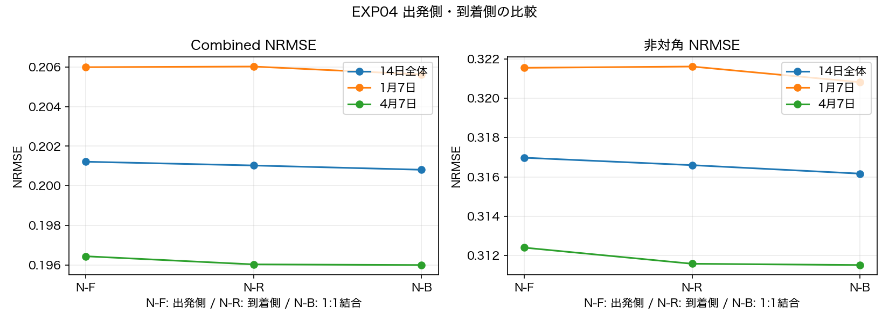
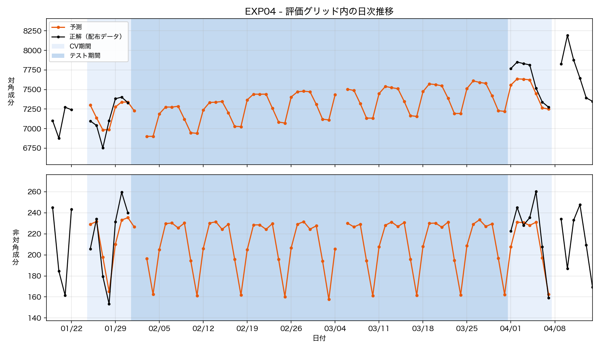
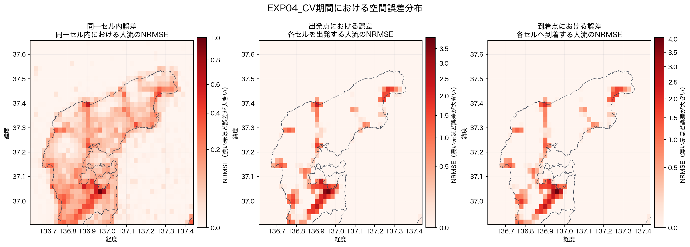

# EXP04 — 出発側・到着側の総量×配分を結合する

- **コード**: [`src/EXP04_run.py`](../../src/EXP04_run.py)
- **事前設計**: [`strategy.md`](strategy.md)
- **数値**: [`metrics.json`](metrics.json)
- **比較元**: [EXP03](../EXP03/report.md)
- **主な出力**: [市町別候補比較](outputs/candidate_municipality_errors.csv)、
  ローカル生成物 `outputs/submission.tsv`
- **図**: [`direction_comparison.png`](figures/direction_comparison.png),
  [`EXP04_pred_dist.png`](figures/EXP04_pred_dist.png),
  [`local_error_map.png`](figures/local_error_map.png)
- **実行記録**: [`.log`](.log)

```bash
python3 src/EXP04_run.py
```

## 仮説

EXP03は出発セルごとの非対角総量を各destinationへ配分していた。
到着セルごとの流入総量からも同じ有向ODを推定すると、一方の分解に偏った誤差を補えるか調べた。
時間軸の逆向き予測を追加した実験ではない。前後観測を使うRTS平滑化はEXP03から使用している。

## 手法

### Stage 0：対角と比較条件を固定

対角はEXP03のD5（避難者率・断水率・降水量）を再学習し、全候補に同じ予測を使用した。
非対角はN8の5群（避難者率・断水率・降水量・積雪・避難所）を固定した。
特徴群の再探索とCatBoost補正は実施していない。

EXP03の採用設定を照合し、順方向を再学習したスコアは
対角・非対角・Combined NRMSEのすべてでEXP03記録値との差が0だった。

### Stage 1：出発側 N-F

    O[t,o] = Σ(d≠o) y[t,o,d]
    r[t,o,d] = y[t,o,d] / O[t,o]
    y_F[t,o,d] = O_hat[t,o] × r_hat[t,o,d]

EXP03と同じ分解。Oはlog1p変換し、rは元尺度で学習した。rはoriginごとに非負化・正規化した。

### Stage 2：到着側 N-R

    I[t,d] = Σ(o≠d) y[t,o,d]
    s[t,d,o] = y[t,o,d] / I[t,d]
    y_R[t,o,d] = I_hat[t,d] × s_hat[t,d,o]

同じy[o,d]を到着セルの列合計で分解した。逆向きの移動量y[d,o]との入れ替えや対称化はしていない。
到着セルを仮想originとするビューを作り、EXP03の状態空間学習関数を再利用した。
元の有向OD順序を維持するため、復元時に別ODへ予測が移ることはない。

総量モデルは物理的な到着セルの特徴、配分モデルは両端を入れ替えた特徴を使用した。
施設数・施設有無・施設数×避難者率の配分特徴は、仮想destinationである物理的な出発セルに付く。
このため、集約方向とそれに対応する特徴の役割を合わせて反転した比較である。

### Stage 3：固定1:1結合 N-B

    y_B[t,o,d] = (y_F[t,o,d] + y_R[t,o,d]) / 2

完成ODの値を平均した。重みの探索や日別・地域別の選択は行っていない。
対角は全候補共通。平均後の行合計・列合計を追加補正していない。

## 検証設計

| 項目 | 内容 |
|---|---|
| CV | 2024-01-25〜01-31、2024-04-01〜04-07の14日 |
| 学習 | 2023-11-01〜2024-10-31の観測日からCVを除く278日 |
| 有向候補OD | マスク後観測から525ペア。方向間で同じ集合 |
| 前処理 | 学習行による欠損平均補完・欠損フラグ・標準化 |
| 時系列 | 2024-01-01で状態リセット。カルマンフィルター＋RTS平滑化 |
| 採点 | 共通モジュールによる公式Combined NRMSE |
| 選択 | N-F、N-R、N-Bの3候補から14日Combined最小 |
| 対角NRMSE | 全候補で0.0854595125 |

CV正解は状態・係数・候補集合の推定へ入れていない。観測日で未記録のODは0、
日全体がNAなら欠損として扱った。流入総量が0の日の配分sも欠損扱いとした。

## 結果

### 候補比較

| 候補 | Combined NRMSE | NRMSE_off | 1月Combined | 4月Combined |
|---|---:|---:|---:|---:|
| N-F：出発側（EXP03再現） | 0.201218 | 0.316977 | 0.205988 | 0.196449 |
| N-R：到着側 | 0.201029 | 0.316599 | 0.206019 | 0.196039 |
| **N-B：1:1結合** | **0.200814** | **0.316168** | **0.205621** | **0.196006** |

N-Bを採用した。EXP03からのCombined差は-0.0004047163（約0.201%改善）、
非対角差は-0.0008094325（約0.255%改善）。
逆方向単独は1月でわずかに悪化したが、1:1結合は1月・4月の両方で改善した。

### 日別の非対角誤差

| 日付 | N-F | N-R | N-B | N-B − N-F |
|---|---:|---:|---:|---:|
| 01-25 | 0.323750 | 0.325768 | 0.323840 | +0.000090 |
| 01-26 | 0.350307 | 0.355683 | 0.352327 | +0.002020 |
| 01-27 | 0.345265 | 0.344751 | 0.344379 | -0.000886 |
| 01-28 | 0.282459 | 0.280705 | 0.280814 | -0.001645 |
| 01-29 | 0.317514 | 0.316409 | 0.316269 | -0.001246 |
| 01-30 | 0.318472 | 0.317401 | 0.317174 | -0.001298 |
| 01-31 | 0.313101 | 0.310593 | 0.310928 | -0.002173 |
| 04-01 | 0.306428 | 0.308182 | 0.306907 | +0.000479 |
| 04-02 | 0.320943 | 0.318225 | 0.319118 | -0.001824 |
| 04-03 | 0.295305 | 0.293031 | 0.293568 | -0.001737 |
| 04-04 | 0.299208 | 0.299052 | 0.298565 | -0.000643 |
| 04-05 | 0.334425 | 0.337180 | 0.335375 | +0.000950 |
| 04-06 | 0.329814 | 0.329741 | 0.329358 | -0.000456 |
| 04-07 | 0.300690 | 0.295662 | 0.297728 | -0.002962 |

14日中10日で改善した。1月26日・4月5日など、既に誤差が大きい日の一部は悪化した。
全日一様な改善ではなく、両分解の平均による小幅な改善と解釈する。

### hit・miss・extra

以下は14日の非対角SSE。公式指標は日別RMSEを平均するため、このSSEの和だけで採用していない。

| 候補 | hit SSE | miss SSE | extra SSE | 合計SSE | extra比率 |
|---|---:|---:|---:|---:|---:|
| N-F | 662.775020 | 31.999877 | 257.081047 | 951.855945 | 27.0084% |
| N-R | 671.659865 | 22.237488 | 256.293002 | 950.190356 | 26.9728% |
| N-B | 672.864627 | 19.453909 | 254.985944 | 947.304479 | 26.9170% |

N-Bのextra SSEは2.095103減少（約0.815%減）、全SSEは4.551466減少した。
missからhitへ分類が変わるペアもあるため、hit SSE増加だけで既存hitが悪化したとは判断できない。
候補集合は同じでも、負値の非負化後に正となるペアが方向間で異なり、結合では片側が正なら正の値が残る。
extra抑制だけでなく、このsupportの差を含んだ改善である。

### 提出物

CV14日を含む全292観測日で再学習し、選択済みN-Bを用いて58日の提出TSVを生成した。
テスト日は教師に含めていない。公式validatorと有限値・非負・日付検査を通過した。
実行日時・学習日数・採用設定・検査結果は`metrics.json`と`.log`へ集約した。

配布データ全域の固定総量への再スケーリングは行っていない。提出ファイルはローカル生成のみである。

## 誤差分析

[市町別比較CSV](outputs/candidate_municipality_errors.csv)の起点・終点NRMSEを使用した。
地域ごとの指標は各地域の固定母数で計算されるため、地域値を単純平均して全体値にはしない。

| 市町 | 起点 N-F | 起点 N-B | 差 | 終点 N-F | 終点 N-B | 差 |
|---|---:|---:|---:|---:|---:|---:|
| 七尾市 | 0.771958 | 0.770180 | -0.001778 | 0.765932 | 0.763382 | -0.002550 |
| 珠洲市 | 0.362638 | 0.364426 | +0.001788 | 0.362637 | 0.364408 | +0.001771 |
| 穴水町 | 0.244046 | 0.242691 | -0.001355 | 0.249432 | 0.247037 | -0.002395 |
| 能登町 | 0.132442 | 0.132036 | -0.000406 | 0.132450 | 0.132121 | -0.000329 |
| 輪島市 | 0.278472 | 0.278721 | +0.000249 | 0.276883 | 0.277183 | +0.000300 |
| 志賀町 | 0.371741 | 0.370267 | -0.001474 | 0.371747 | 0.370270 | -0.001477 |
| 中能登町 | 1.131567 | 1.122789 | -0.008778 | 1.164183 | 1.159823 | -0.004360 |
| 羽咋市 | 0.407110 | 0.408253 | +0.001143 | 0.383656 | 0.383142 | -0.000514 |

七尾市・中能登町・穴水町などで改善した。珠洲市と輪島市は両側で悪化した。
能登町は小幅に改善したものの、起点SSE/全ゼロSSEは0.979328から0.975791で、
全ゼロ予測に近い誤差水準が残っている。この追加だけで能登町の課題を解消したとは言えない。
羽咋市も公式採点には含めたが、部分的な評価領域なので市全体の性能とは解釈しない。

## 図と考察

### `figures/direction_comparison.png`



N-RはN-Fより全体と4月で改善する一方、1月はわずかに悪化する。N-Bは3期間すべてでN-Fを
下回り、固定1:1平均が片方向固有の誤差を小さく相殺した。ただし候補間の差は非常に小さく、
新しい情報を追加したというより、よく似た2予測の分散低減と解釈するのが妥当である。

### `figures/EXP04_pred_dist.png`



集約日次推移はEXP03とほぼ同じで、週次変動と中期水準を維持している。1:1結合の効果は総量の
大きな形を変えるものではなく、個々の有向ODへの配分を微調整するものだと分かる。CV部分では
4月初旬の過小予測も残り、結合だけでは日単位の急変を補えない。図の人流は評価対象ODの合計で、
提出全域の日次合計とは異なる。

### `figures/local_error_map.png`



EXP03と共通尺度で見ると空間分布はほぼ同じで、南部と沿岸部の高誤差セルが残る。改善は局所的
かつ小さいため、ヒートマップ上で明瞭な領域変化としては現れない。市町表で改善した七尾市・
中能登町・穴水町と、悪化した珠洲市・輪島市を数値で併読する必要がある。

## 解釈

両方向の誤差相関は0.992131だった（学習由来の候補525ペア×14日、計7,350行の診断）。
予測差の平均絶対値は0.025955。両方向は同じ観測を異なる分母で分解しているため、
誤差も非常によく似ており、大幅な改善にはつながらなかったと考えられる。

新たなイベント情報を入れた実験ではなく、避難所や気象の因果的効果を示す結果でもない。
正解が未知のテスト58日に対する改善は未検証である。

## 失敗した試み

到着側単独への全面置換は全体では微改善だが、1月は悪化し、固定平均よりも悪かった。
そのため、今回は到着側だけを採用せず、両方を1:1で結合した。

## 採否判定

14日CVで最良だったN-BをEXP04の採用候補とする。対角はD5、非対角はN-FとN-Rの固定1:1結合。
EXP03の再現値を残したうえで、微改善として記録する。独立期間での汎化改善が確認されたとは扱わない。

## 制約・未解決

- CVの5モデル（D5、出発総量・配分、到着総量・配分）はすべてEM上限200回で未収束。
  比較は同じ固定反復数での結果であり、最適尤度へ収束した保証はない。
- CV14日における配分負値の割合は、非負化前で出発側15.4558%、到着側15.1565%。
  到着側では42件の到着セル×日で学習比率fallbackを使った。分母はCV14日であり、
  EXP03の全366日を対象にした診断値と直接比較しない。
- 方向間で特徴の役割も反転するため、純粋な行/列正規化だけの差を識別する実験ではない。
- 同じ14日CVを複数実験の選択に使っており、独立評価は増やしていない。
- 外部率の前処理はEXP03から継承し、観測された100%超の断水率を自動クリップしていない。
